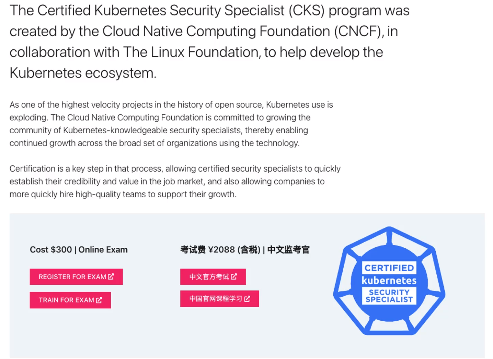

# Exam Information

  - Take me to the [Video Tutorial](https://kodekloud.com/topic/exam-information/)
    
    
## Certification Details

   - CKA certification (non-expired) is required to sit for this exam.

   - **`Certified Kubernetes Security Specialist`**: https://training.linuxfoundation.org/certification/certified-kubernetes-security-specialist/

   - **`Exam Curriculum (Topics)`**: https://github.com/cncf/curriculum

   - **`Candidate Handbook`**: https://docs.linuxfoundation.org/tc-docs/certification/lf-candidate-handbook

   - **`Exam Tips`**: https://docs.linuxfoundation.org/tc-docs/certification/important-instructions-cks
