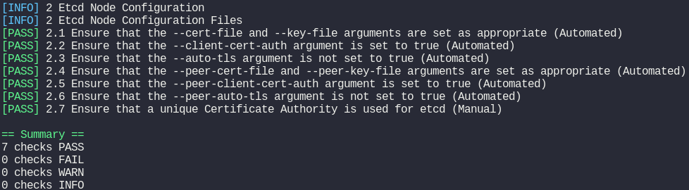
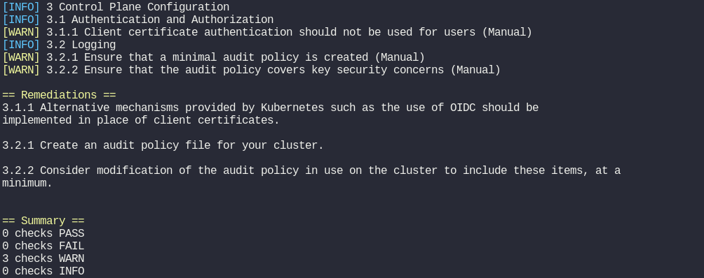

# Lab - Kube-bench

- Take me to the [Lab](https://kodekloud.com/topic/lab-kube-bench/)

Solutions for lab - Kube-bench:-

- Kube bench is a product of **`Aqua Security`** company.

- kube-bench should be used for **`To check whether Kubernetes is deployed as per security best practices`**

- Install the kube-bench with version v0.4.0 under the `/root` directory
    ```sh
    curl -L https://github.com/aquasecurity/kube-bench/releases/download/v0.4.0/kube-bench_0.4.0_linux_amd64.tar.gz -o kube-bench_0.4.0_linux_amd64.tar.gz
    tar -xvf kube-bench_0.4.0_linux_amd64.tar.gz
    ```

- There are **`7`** tests passed for Etcd Node Configuration

  

- There are **`0`**  tests failed for Control Plane Configuration

  

- Fix this failed test 1.3.1 Ensure that the `--terminated-pod-gc-threshold` argument is set as appropriate. **`1.3.1 Edit the Controller Manager pod specification file /etc/kubernetes/manifests/kube-controller-manager.yaml on the master node and set the --terminated-pod-gc-threshold to an appropriate threshold, for example: --terminated-pod-gc-threshold=10`**

- The **`1.3.6 Edit the Controller Manager pod specification file /etc/kubernetes/manifests/kube-controller-manager.yaml
on the master node and set the --feature-gates parameter to include RotateKubeletServerCertificate=true. --feature-gates=RotateKubeletServerCertificate=true`** is used to fix the failed test 1.3.6 Ensure that the `RotateKubeletServerCertificate` argument is set to true.

