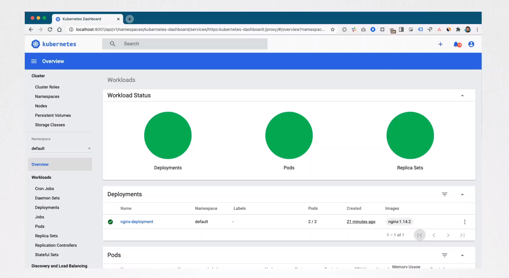

# Kubernetes Dashboard

  - Take me to the [Video Tutorial](https://kodekloud.com/topic/kubernetes-dashboard/)

In this section, we will take a look at `Kubernetes Dashboard`.

  - Dashboard is a web-based Kubernetes user interface. You can use Dashboard to deploy containerized applications to a Kubernetes cluster, troubleshoot your containerized application, and manage the cluster resources. You can use Dashboard to get an overview of applications running on your cluster, as well as for creating or modifying individual Kubernetes resources (such as Deployments, Jobs, DaemonSets, etc). For example, you can scale a Deployment, initiate a rolling update, restart a pod or deploy new applications using a deploy wizard.

    

  - Kubernetes Dashboard is accessible to anyone by default.

