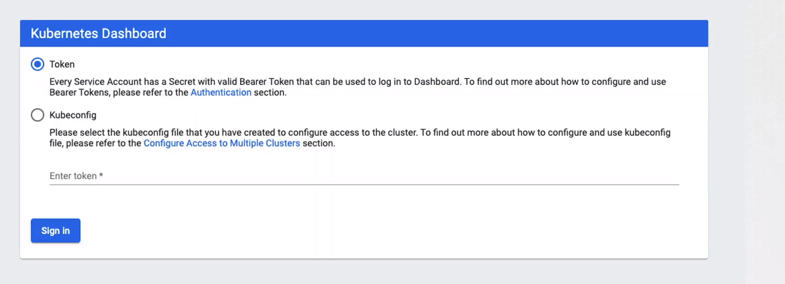

# Securing Kubernetes Dashboard

  - Take me to the [Video Tutorial](https://kodekloud.com/topic/securing-kubernetes-dashboard/)

In this section, we will take a look at `Securing Kubernetes Dashboard`.

  - Dashboard supports logging in with a Bearer Token and KubeConfig.

  
