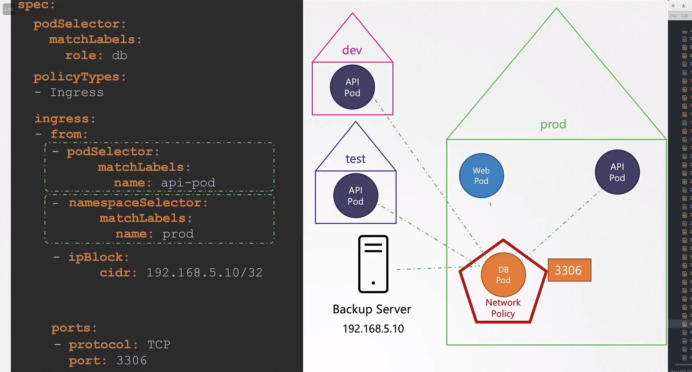

# Developing Network Policies

  - Take me to the [Video Tutorial](https://kodekloud.com/topic/developing-network-policies-3/)

In this section, we will take a look at `Developing Network Policies`.

## Create network policy

  -   
