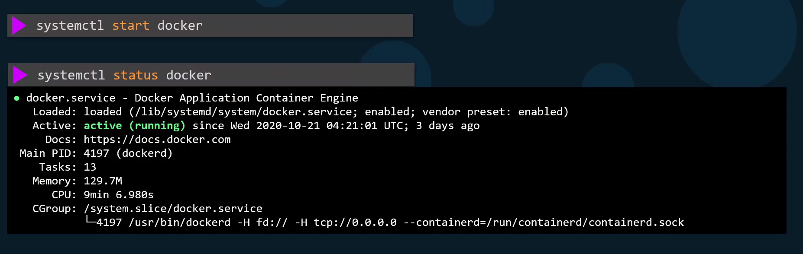
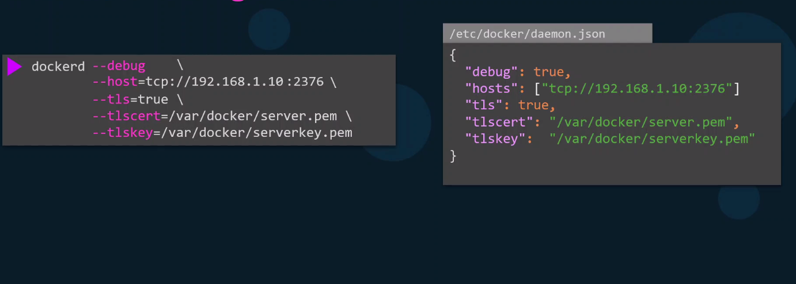

# Docker Service Configuration

  - Take me to the [Video Tutorial](https://kodekloud.com/topic/docker-service-configuration-2/)

In this section, we will take a look at `Docker Service Configuration`.

### Check Docker service status

  

### Docker Daemon Configuration File

  
