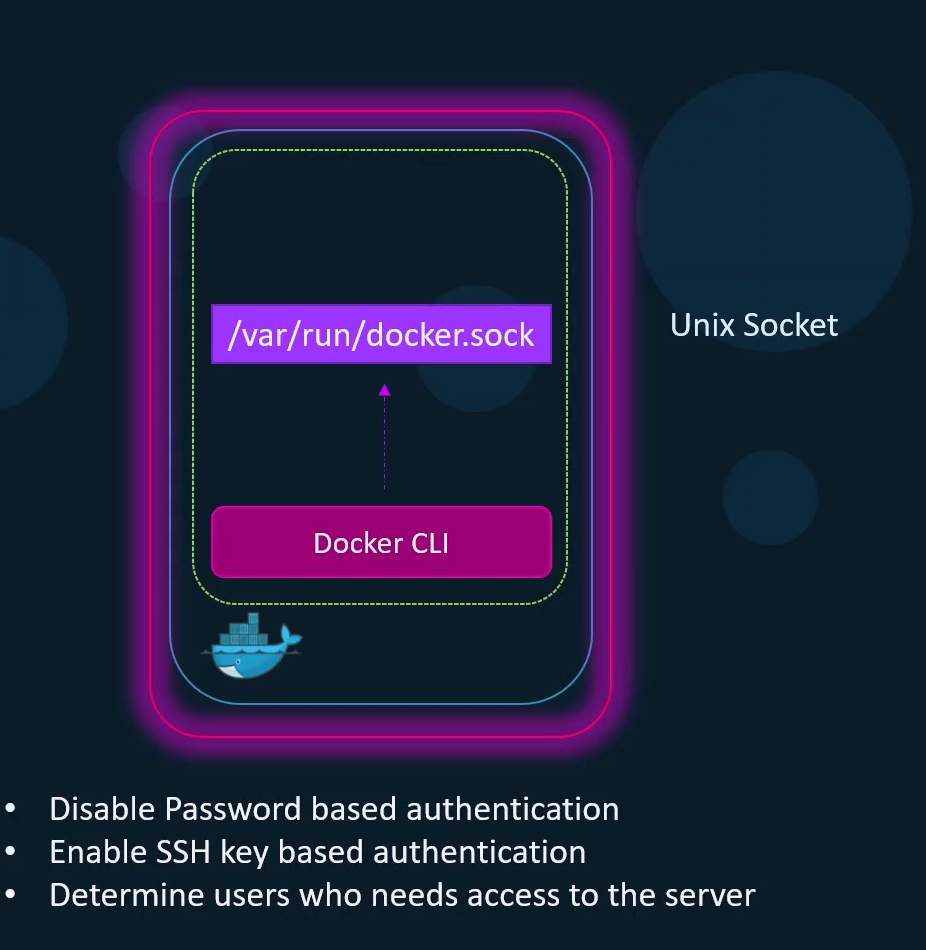

# Docker Securing the Daemon

  - Take me to the [Video Tutorial](https://kodekloud.com/topic/docker-securing-the-daemon/)

In this section, we will take a look at `Docker Securing the Daemon`.

### Secure Docker Server
  

