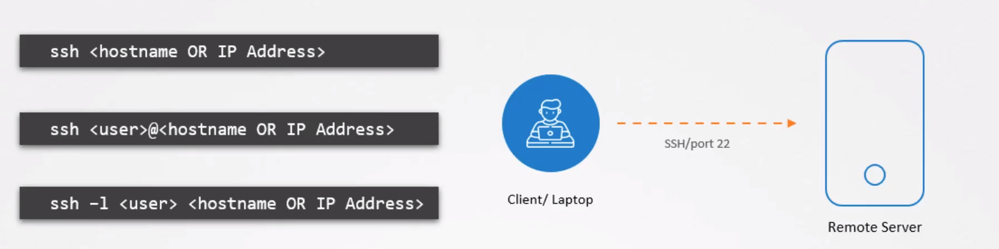
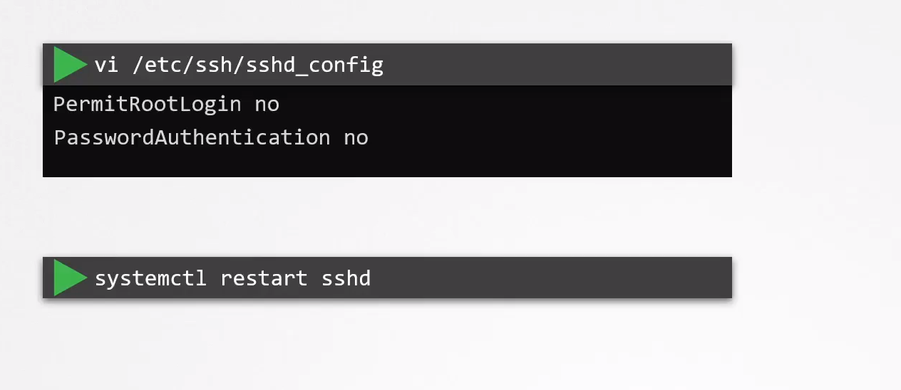

# SSH Hardening

  - Take me to the [Video Tutorial](https://kodekloud.com/topic/ssh-hardening/)

In this section, we will take a look at `SSH Hardening`.

 - SSH is used for logging into a remote machine and for executing commands on a remote machine.

 - The basic syntax of doing this is to run the SSH command followed by the IP address or hostname of the server you want to connect to.
 
    

 - A more secure way is to make use of a cryptographic key pair that uses private and public keys to authenticate to the system.

 - To improve the security of the system:

      - Disable SSH for the root account. This ensures that no one can login remotely using the root account and only as their own user account

        
