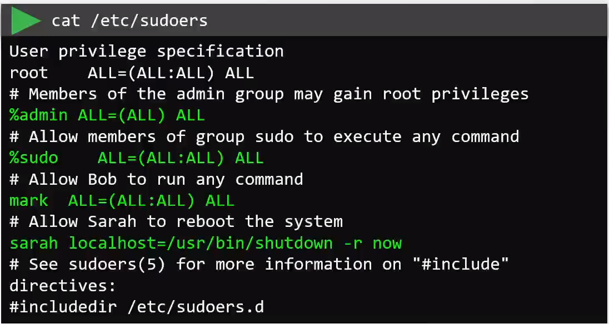

# Privilege Escalation in Linux

  - Take me to the [Video Tutorial](https://kodekloud.com/topic/privilege-escalation-in-linux/)

In this section, we will take a look at `Privilege Escalation in Linux`.

- The sudo command offers another approach to giving users administrative access. When trusted users precede an administrative command with sudo, they are prompted for their own password.

- The default configuration for sudo is defined under `/etc/sudoers` file.

  
