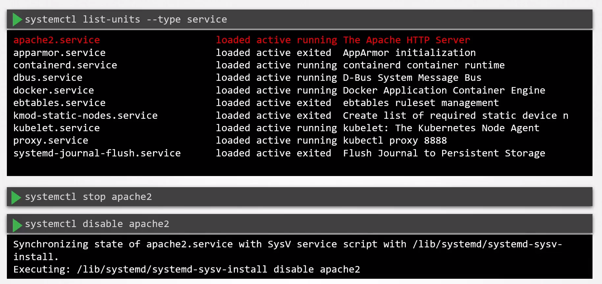

#  Remove Obsolete Packages and Services

  - Take me to the [Video Tutorial](https://kodekloud.com/topic/remove-obsolete-packages-and-services/)

In this section, we will take a look at `Remove Obsolete Packages and Services`.

 - Keep the system as lean as possible by making sure that only the required software is installed and the ones that are installed are constantly updated to address security fixes.

 - The systemctl tool allows us to manage the systemd-services such as getting the status, starting and stopping the services.

      
