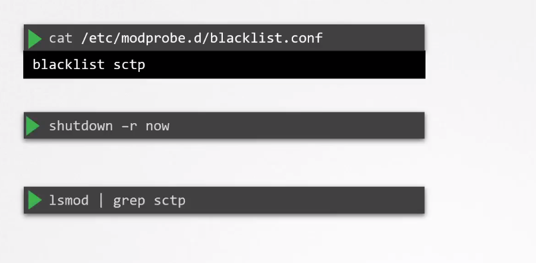

# Restrict Kernel Modules

  - Take me to the [Video Tutorial](https://kodekloud.com/topic/restrict-kernel-modules/)

In this section, we will take a look at Restrict Kernel Modules.

  - The Linux Kernel has a modular design that allows the Kernel to extend its capabilities by the means of dynamically loaded kernel modules.

  - The sctp kernel module is not commonly used in Kubernetes cluster and can be black listed on the nodes by adding the following entry to the blacklist configuration file.

      

