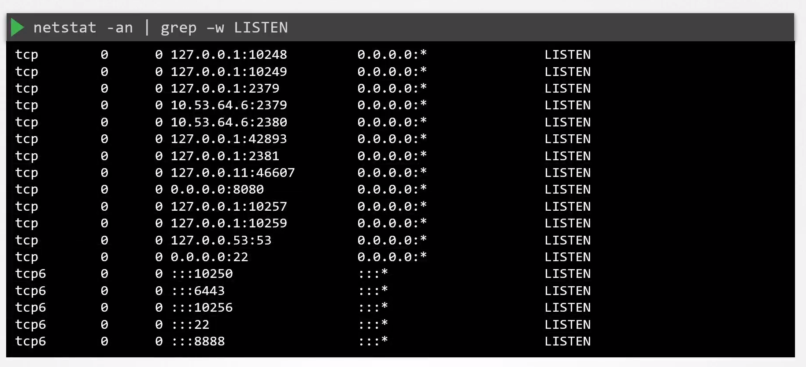
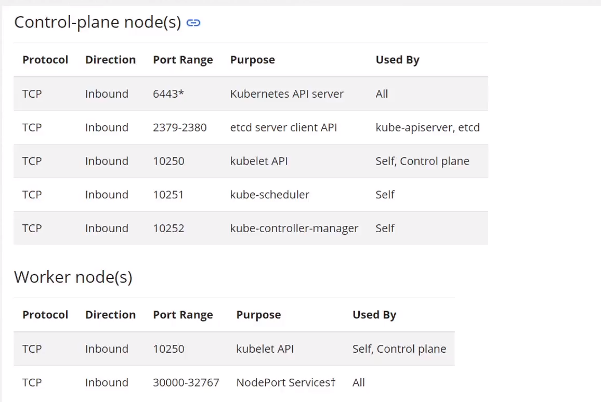

# Identify and Disable Open Ports

  - Take me to the [Video Tutorial](https://kodekloud.com/topic/identify-and-disable-open-ports/)

In this section, we will take a look at `Identify and Disable Open Ports`.

  - To check if a port is used and listen for connection requests, you can make use of the `netstat` command.  

  

  - Kubernetes required ports

  

### Reference

https://kubernetes.io/docs/setup/production-environment/tools/kubeadm/install-kubeadm/#check-required-ports
