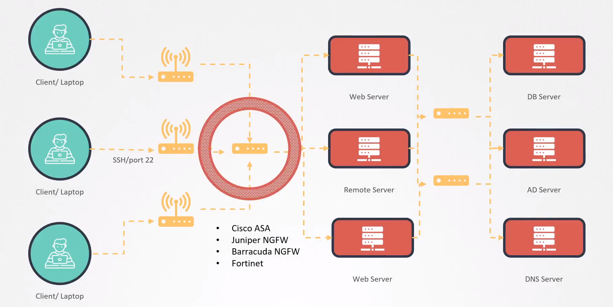

# Minimize external access to the network

  - Take me to the [Video Tutorial](https://kodekloud.com/topic/minimize-external-access-to-the-network/)

In this section, we will take a look at `Minimize external access to the network`.

- In a real-world environment that has many different clients and many different servers all connected through a large network with many different switches and routers, it is important that we implement network security to allow or restrict access to the various services and ports. Such as which servers allow SSH access or which servers can access what services on what port etc.

- We can apply such security either network wide using external firewalls or appliances such as Cisco ASA, Juniper NextGen Firewall, Barracuda NextGen Firewall, Fortinet etc.

