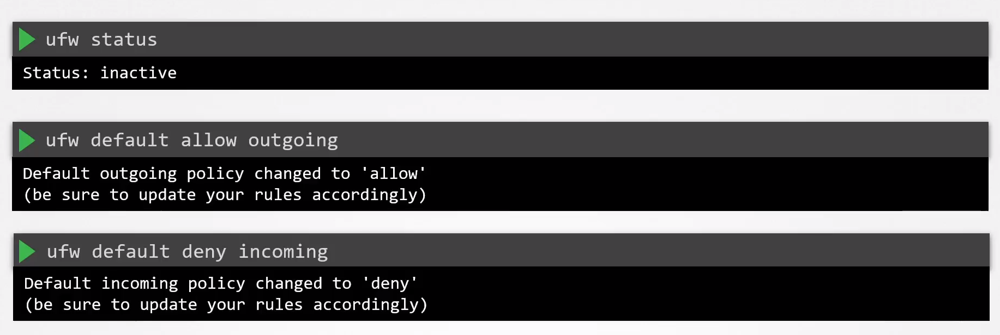
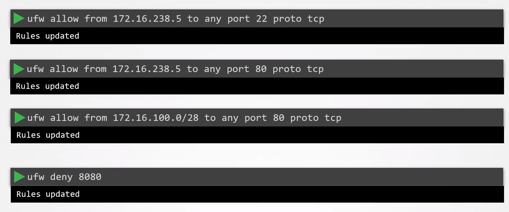
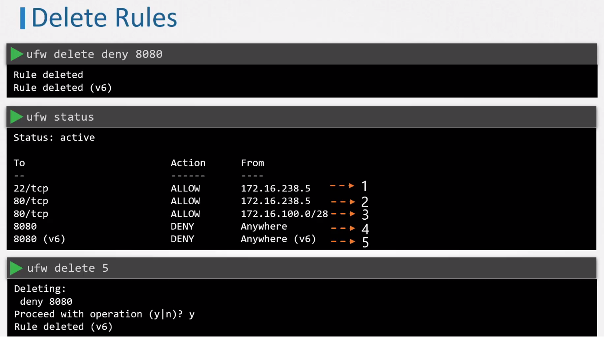

# UFW Firewall Basics

  - Take me to the [Video Tutorial](https://kodekloud.com/topic/ufw-firewall-basics/)

In this section, we will take a look at `UFW Firewall Basics`.

- UFW which stands for Uncomplicated Firewall. UFW is a simple frontend interface for Iptables, which as the name suggests provides a simple and easy to use interface to set up firewall rules.

- iptables is perhaps the most common tools used to configure the firewall

### UFW Rules

    ufw status

    ufw default allow outgoing

    ufw default deny incoming

### Allowed & denied Rules
add an allow rule to permit SSH connections from the jump server with the IP 172.16.238.5

      ufw allow from 172.16.238.5 to any port 22 proto tcp

   

### Delete Rules

    ufw delete deny 8080

    ufw status

    ufw delete 5

