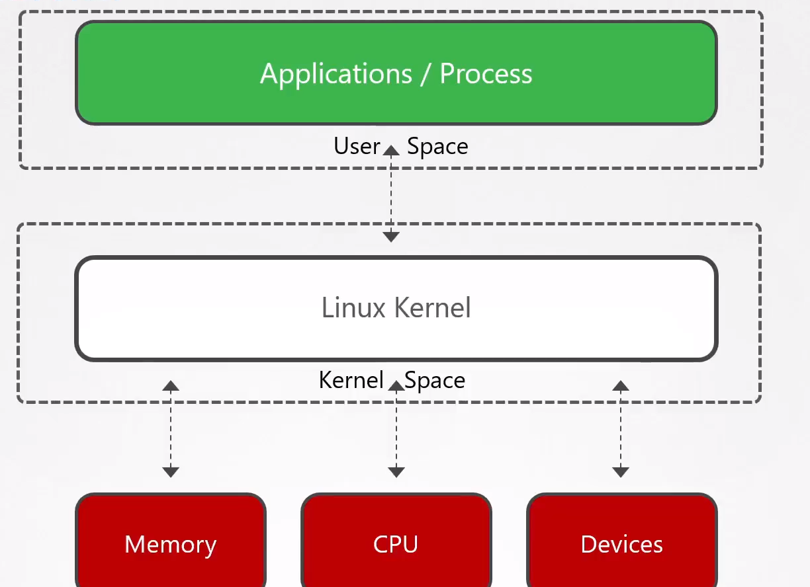
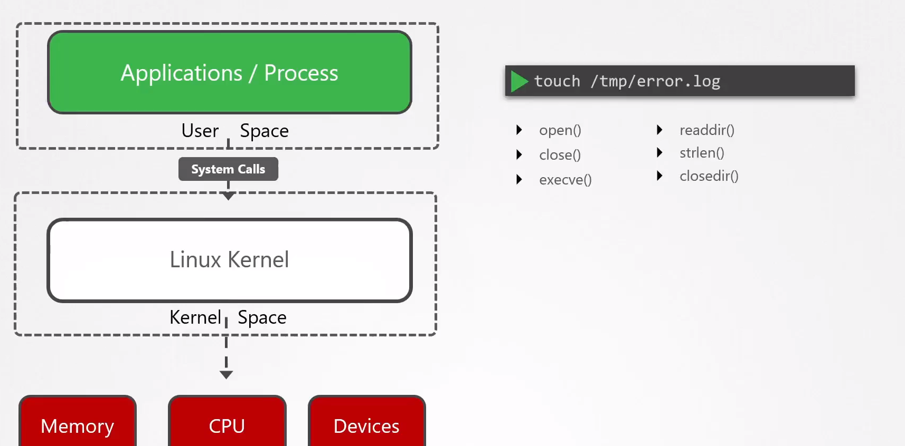
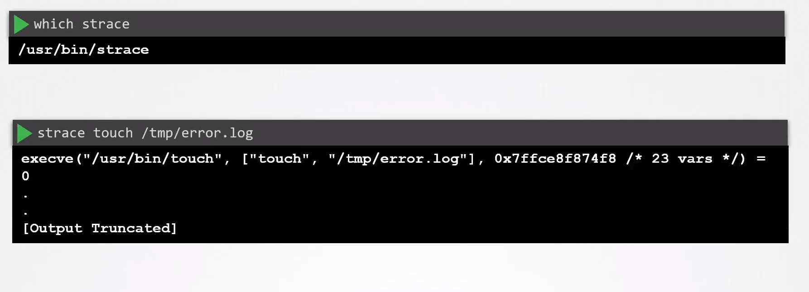

# Linux Syscalls

  - Take me to the [Video Tutorial](https://kodekloud.com/topic/linux-syscalls/)

In this section, we will take a look at `Linux Syscalls`.

  - A kernel is the major component of an operating system and is the core interface between a computer’s hardware and its processes.

  - The Kernel can be divided into two memory areas, user space and kernel space.

  

  - Applications running in user space get access to data on devices by making special requests to the kernel called system calls.

  - If we want to create an empty file called error.login the /tmp file system – it will make  several system calls.

    

  - Tracing the syscalls used by a process

        which trace
        strace touch /tmp/error.log

  
