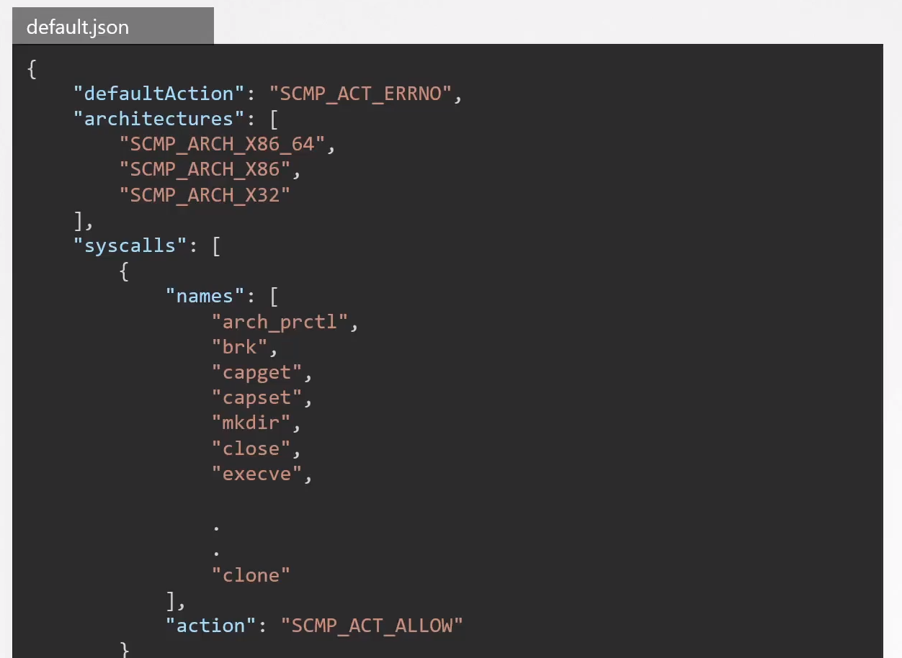

# Restrict Syscalls using Seccomp

  - Take me to the [Video Tutorial](https://kodekloud.com/topic/restrict-syscalls-using-seccomp/)

In this section, we will take a look at `Restrict Syscalls using Seccomp`.

  - By default, the Linux kernel would allow any syscall to be invoked by programs running in the user space which can increase the attack surface.

  - Seccomp stands for secure computing and it is a Linux Kernel feature that can be used to sandbox applications to only use the syscalls they need.

### Seccomp Modes

- Docker has a built-in seccomp filter that it uses by default whenever we create a container.

  

### References

- https://github.com/moby/moby/tree/master/profiles/seccomp
