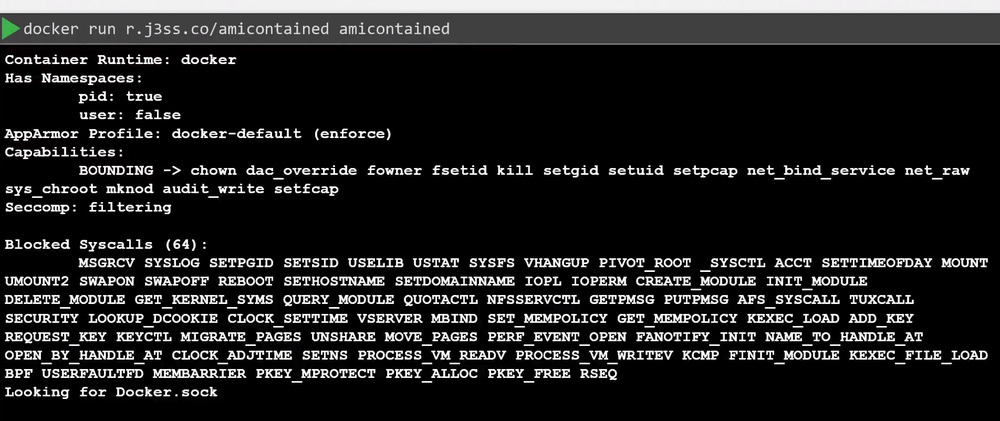
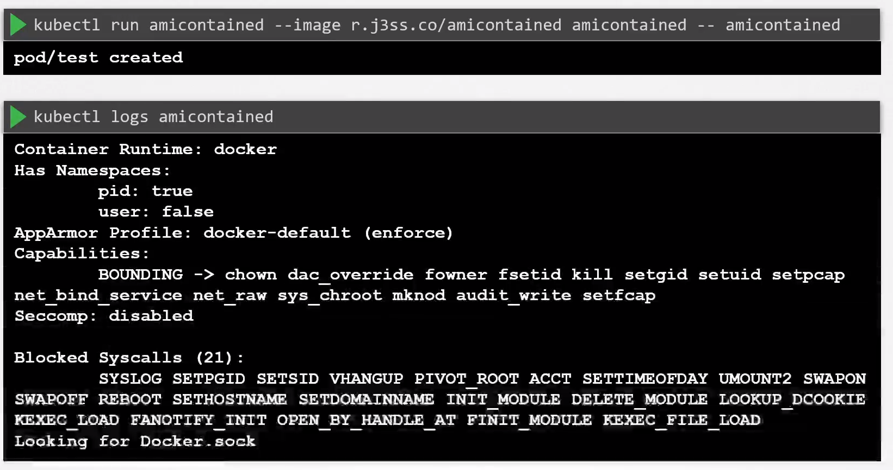
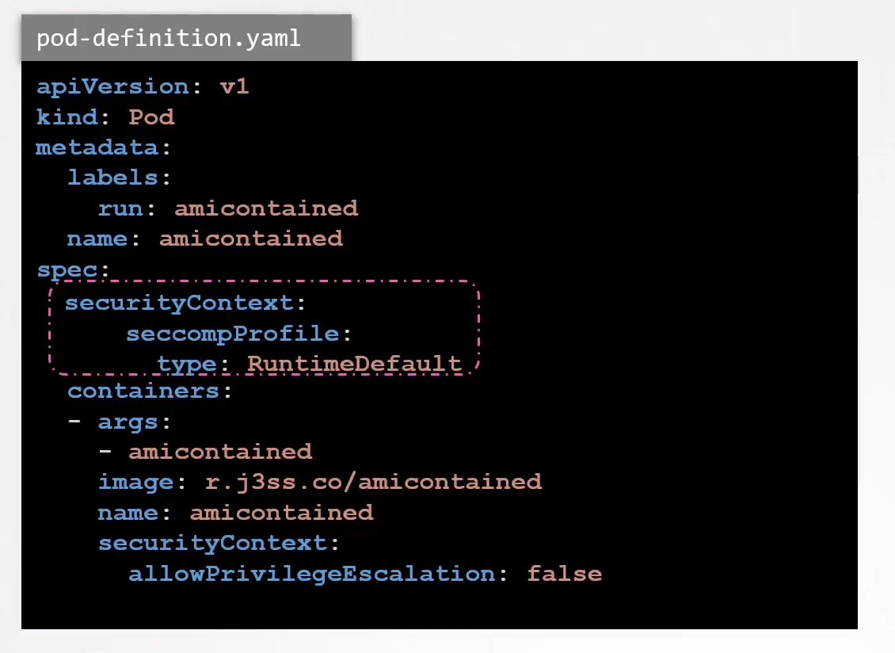

# Implement Seccomp in Kubernetes

  - Take me to the [Video Tutorial](https://kodekloud.com/topic/implement-seccomp-in-kubernetes/)

In this section, we will take a look at `Implement Seccomp in Kubernetes`.

### Seccomp in Docker

    docker run r.j3ss.co/amicontained amicontained

### Seccomp in Kubernetes

    kubectl run amicontained --image r.j3ss.co/amicontained amicontained -- amicontained

    kubectl logs amicontained

    apiVersion: v1
    kind: Pod
    metadata:
      labels:
        run: amicontained
      name: amicontained
    spec:
      securityContext:
        seccompProfile:
          type: RuntimeDefault
      containers:
      - args:
        - amicontained
        image: r.j3ss.co/amicontained
        name: amicontained
        securityContext:
          allowPrivilegeEscalation: false

### References

- https://kubernetes.io/docs/tutorials/clusters/seccomp/
