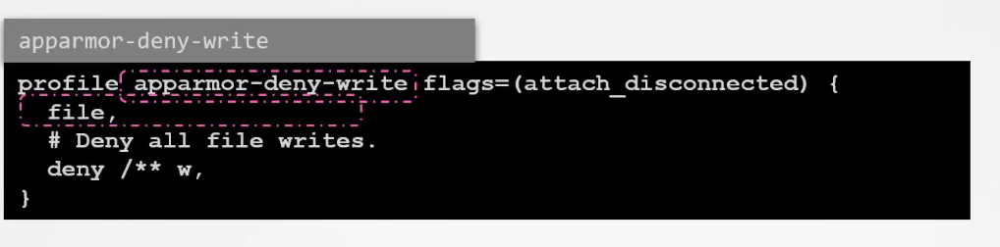

# AppArmor

  - Take me to the [Video Tutorial](https://kodekloud.com/topic/apparmor/)

In this section, we will take a look at `AppArmor`.

- **`AppArmor ("Application Armor")`** is a Linux kernel security module that allows the system administrator to restrict programs' capabilities with per-program profiles. Profiles can allow capabilities like network access, raw socket access, and the permission to read, write, or execute files on matching paths.

- AppArmor is installed by default on the most Linux distribution.

  **`systemctl status apparmor`**

- AppArmor confinement is provided via profiles loaded into the kernel. AppArmor can be set to either enforce the profile or complain when profile rules are violated.

  
