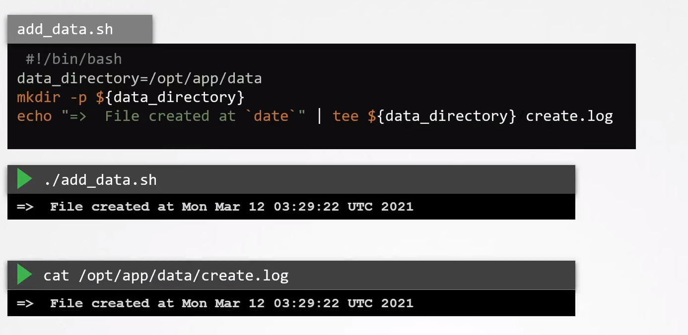
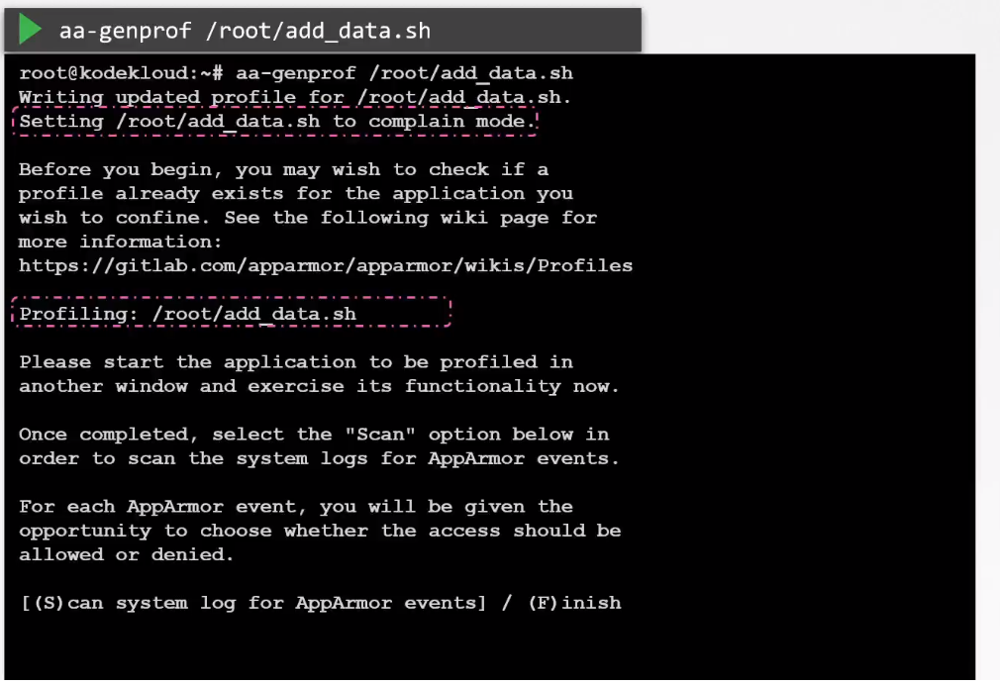

# Creation AppArmor Profiles

  - Take me to the [Video Tutorial](https://kodekloud.com/topic/creating-apparmor-profiles/)

In this section, we will take a look at `Creation AppArmor Profiles`.

### A simple bash script

    #!/bin/bash
    data_directory=/opt/app/data
    mkdir -p ${data_directory}
    echo "=>  File created at `date`" | tee $(data_directory) create.log

### Install AppArmor utils package

    sudo apt install  apparmor-utils -y

### Create a profile for bash script

    aa-genprof /root/add_data.sh

### Run a bash script from a different window

    ./add_data.sh
