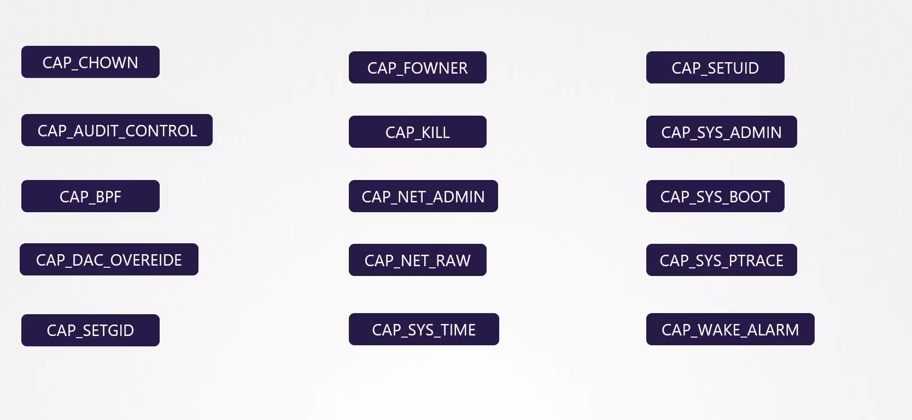
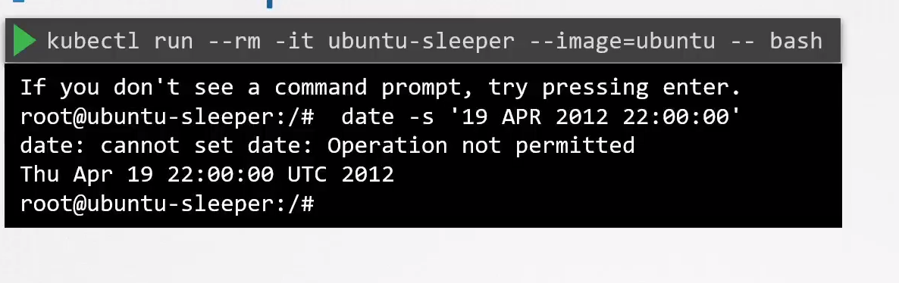
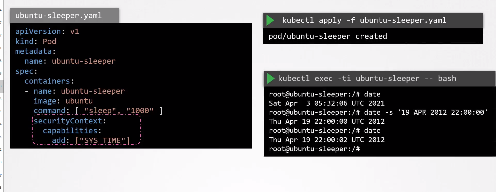

# Linux Capabilities

  - Take me to the [Video Tutorial](https://kodekloud.com/topic/linux-capabilities/)

In this section, we will take a look at `Linux Capabilities`.

- Linux capabilities provide a finer grained breakdown of the privileges traditionally associated with the superuser.

  

###  Linux Capabilities in kubernetes

  - The **`date -s '19 APR 20120 22:00:00'`** command is not permitted

        kubectl run --rm -it ubuntu-sleeper --image=ubuntu -- bash

  

        apiVersion: v1
        kind: Pod
        metadata:
          name: ubuntu-sleeper
        spec:
          containers:
          - name: ubuntu-sleeper
            image: ubuntu
            command: ["sleep", "1000"]
            securityContext:
              capabilities:
                add: ["SYS_TIME"]

        kubectl apply -f ubuntu-sleeper.yml

        kubectl exec -it ubuntu-sleeper -- bash

### References

- https://kubernetes.io/docs/tasks/configure-pod-container/security-context/#set-capabilities-for-a-container
