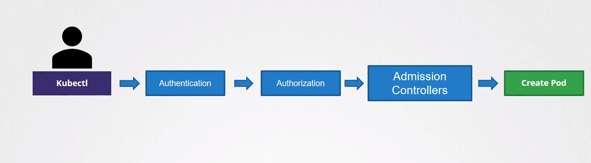

# Admission Controllers

  - Take me to the [Video Tutorial](https://kodekloud.com/topic/admission-controllers/)

In this section, we will take a look at `Admission Controllers`.

  - When a request comes in , say to create a pod, it goes through authentication, authorization and then through admission controllers before being created.

  - Kubernetes admission controllers are plugins that govern and enforce how the cluster is used.

  

### With Admission Controllers, you can

- Only permit images from a certain registry.
- Don't permit runAs root user.
- Only permit certain capabilities.
- Pods always have labels.

### To see which admission plugins are enabled:

    kubectl exec kube-apiserver-controlplane -n kube-system -- kube-apiserver -h | grep enable-admission-plugins

### Add an admission controller NamespaceAutoProvision

      vim /etc/kubernetes/manifests/kube-apiserver.yaml

      update --enable-admission-plugins=NodeRestriction

      with --enable-admission-plugins=NodeRestriction,NamespaceAutoProvision

  - `--admission-control` was deprecated in 1.10 and replaced with `--enable-admission-plugins`.

### References

- https://kubernetes.io/docs/reference/access-authn-authz/admission-controllers/
