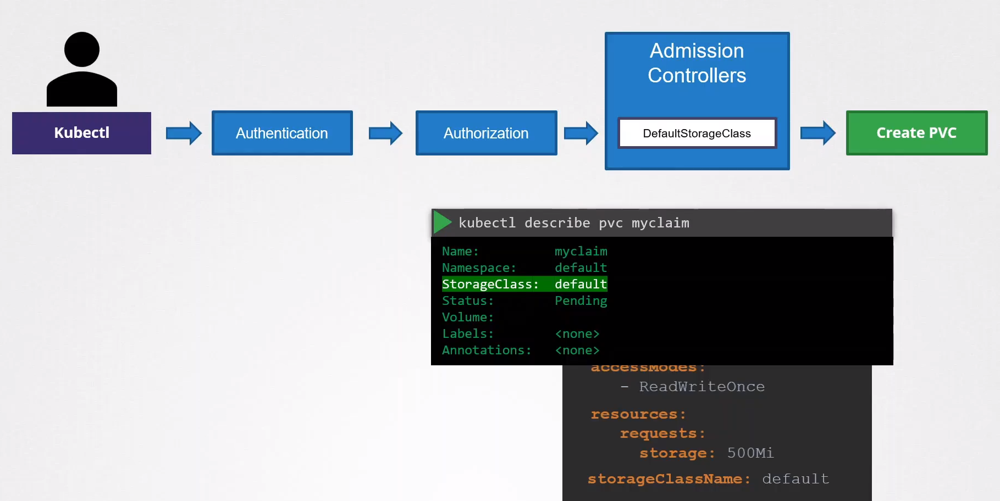

# Validating and Mutating Admission Controllers

  - Take me to the [Video Tutorial](https://kodekloud.com/topic/validating-and-mutating-admission-controllers/)

In this section, we will take a look at `Validating and Mutating Admission Controllers`.

  - Admission controllers may be "validating", "mutating", or both.

  - Mutating controllers may modify the objects they admit; validating controllers may not.

  - The admission control process proceeds in two phases. In the first phase, mutating admission controllers are run. In the second phase, validating admission controllers are run.

  - DefaultStorageClass plugin is enabled by default.

  - When you are submitting a request to create a PVC. The request goes through authentication, authorization and finally the admission controller. The defaultStorageClass admission controller will watch for requests to create a PVC and check if it has a storage class mentioned in it. If not, it will modify your request to add the default storage class to your request. This could be whatever storage class is configured as the default storage class in your cluster. So when the pvc is created and you inspect it you’ll see that a storage class default is added to it, even though you hadn’t specified it during creation. So this type of admission controller is known as a mutating admission controller. It can change or mutate the object itself before it is created.

myclaim.yaml

    apiVersion: v1
    kind: PersistentVolumeClaim
    metadata:
      name: myclaim
    spec:
      accessModes:
        - ReadWriteOnce
      resources:
        requests:
          storage: 500Mi  

  kubectl create -f myclaim.yaml

    kubectl describe pvc myclaim

  

### Custom Admission Controller

 - Admission plugins can be developed as extensions and run as webhooks configured at runtime.

 -  You can define two types of admission webhooks, validating admission webhook and mutating admission webhook.

 - Mutating admission webhooks are invoked first, and can modify objects sent to the API server to enforce custom defaults. After all object modifications are complete, and after the incoming object is validated by the API server, validating admission webhooks are invoked and can reject requests to enforce custom policies.

## References

- https://github.com/kubernetes/kubernetes/tree/v1.13.0/test/images/webhook
