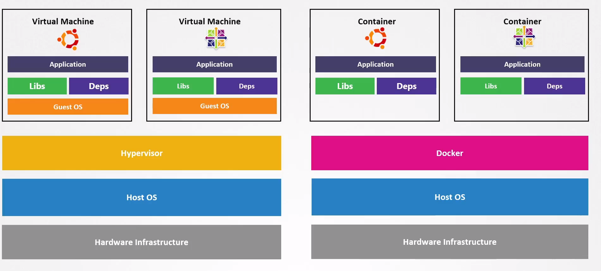

# Container Sandboxing

  - Take me to the [Video Tutorial](https://kodekloud.com/topic/container-sandboxing/)

In this section, we will take a look at `Container Sandboxing`.

### Virtual Machine VS Container

- Comparing a virtual machine to a container –one of the key differences is that all containers on a server -whether it’s a virtual machine or a physical server, share the same underlying kernel.

- From the perspective of a host, it is just another process which is isolated from the host and other containers running on it.

  
  
- The virtualized hardware isolation creates a much stronger security boundary than namespace isolation. The risk of an attacker escaping a container (process) is much higher than the chance of escaping a VM. The reason for higher container escaping risk lies on the weak isolation that namespace and cgroup create. Linux implements namespace and cgroup by associating new property fields to each process. These fields under the /proc file system tell the host OS if one process can see the other or how much the CPU/Memory budget that the process can use.
