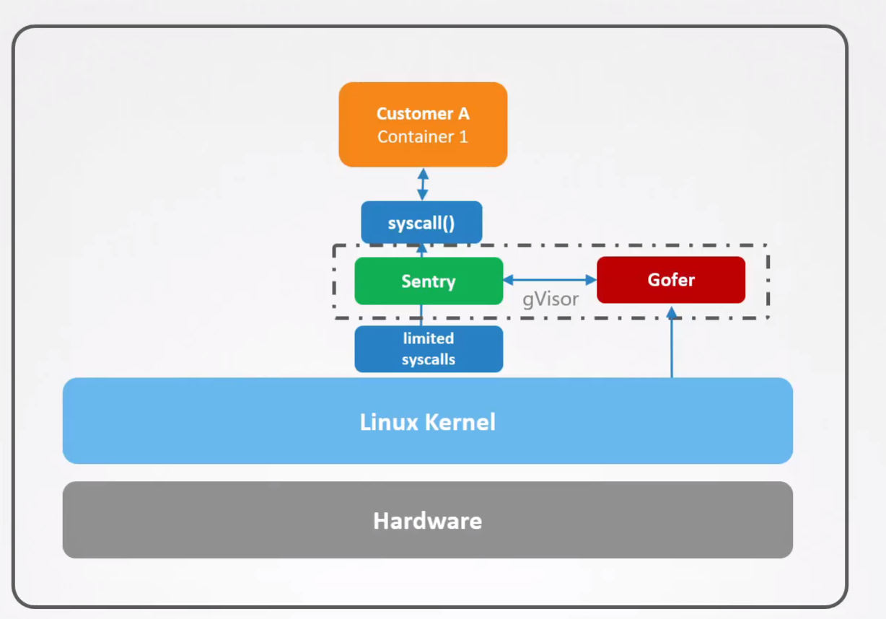

# gVisor

  - Take me to the [Video Tutorial](https://kodekloud.com/topic/gvisor/)

In this section, we will take a look at `gVisor`.

  - gVisor is a tool from google that allows an additional layer of isolation between the container and the kernel.

  - When a program in a container wants to make a system call to the Linux kernel, it actually makes a call to gVisor now.

  - gVisor Sandbox consists of two major components that work together to achieve stronger isolation when compared to traditional containers.The first component is called **`sentry`** - which can be described as an independent application level kernel dedicated for containers.

  - The main purpose of Sentry is to intercept and respond to system calls made by the containerized application.

  - Sentry talks to a dedicated process called **`Gofer`** .

  - Gofer is a file proxy that implements the logic needed to give container apps access to system files.

  - Since system calls are received and processed via a middleman, this means there are more instructions the CPU has to go through. This can make the applications slightly slower as compared to traditional containers.

  

