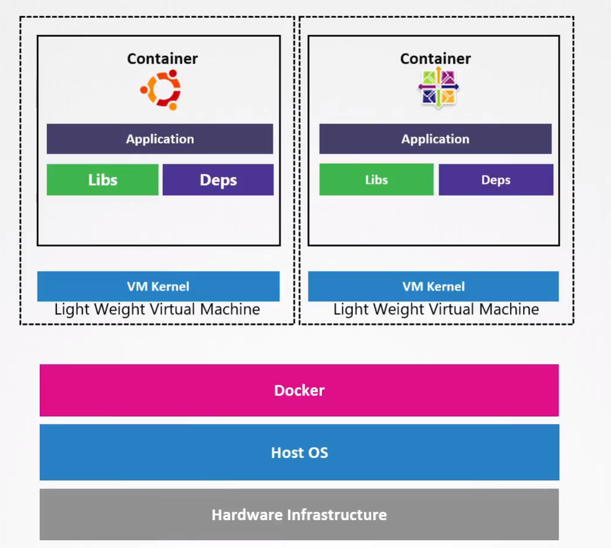

# Kata Containers

  - Take me to the [Video Tutorial](https://kodekloud.com/topic/kata-containers/)

In this section, we will take a look at `Kata Containers`.

  - Kata takes a different approach to sandbox containers as compared to gVisor.

  - Kata inserts each container into its own, separate virtual machine. And each container will have its own, dedicated kernel running inside.

  - Just like with gVisor, this gets rid of the problems caused when all container apps communicate directly with the same operating system kernel. Now they each have their own little kernel to bother with, so if they crash it or abuse it in any way, it doesn't bring the whole system down; only that specific container will experience problems instead of all of them.

  - The Virtual Machines that are created by Kata are light weight and are focused on performance.

  - Since Kata containers need hardware virtualization support, this means that you might not be able to run them on your typical cloud service provider.

  - A cloud compute instance is already a virtual machine. So if you intend to use Kata you are basically trying to run a virtual machine inside another virtual machine. This is called **`nested virtualization`** which is not supported by many cloud providers.

  
