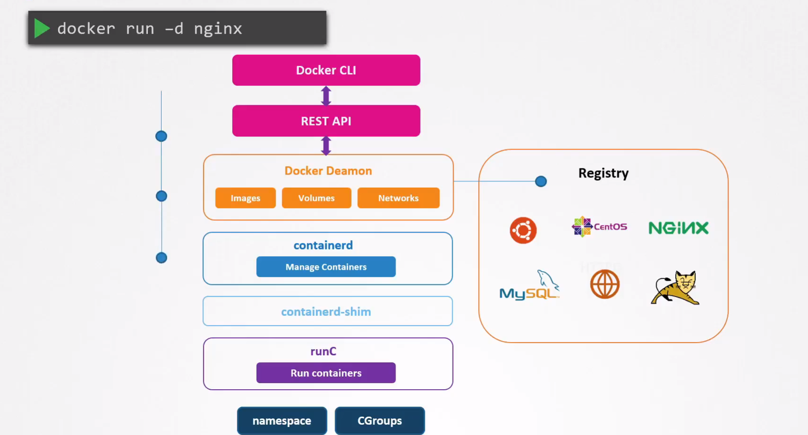
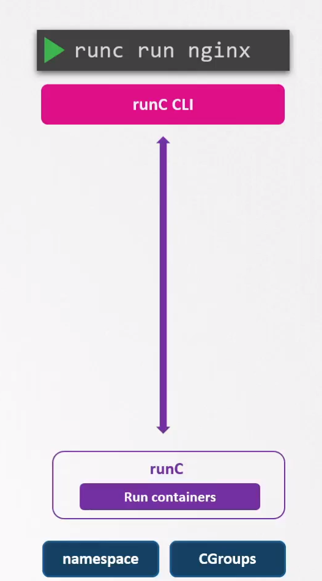

# Runtime Classes

  - Take me to the [Video Tutorial](https://kodekloud.com/topic/runtime-classes/)

In this section, we will take a look at `Runtime Classes`.

### What will happen when you run **`docker run -d nginx`** ?

 - The Docker client converts the command into a RESTful API which is then passed to the Docker Daemon.

 - The Docker Daemon on receiving the instruction, first checks if the image provided is already available on the local system. If it is not the image is downloaded from the Docker registry the default being **`Docker hub`**.

 - Once the image is downloaded it makes a call to **`containerd`** to start the container. containerd is responsible for converting the image into an OCI compliant bundle. It then passes the bundle to **`containerd-shim`** which in turn calls container Runtime –the **`runc`** to start the container.

- RunC interacts with the namespaces and cgroups on the kernel to create a "Container."

  

### RunC

  - With runC installed on a server, we can run containers without using Docker using the runc CLI. However, without the features provided by Docker such as image, volume & network management, it would be difficult to manage the life cycle of this container.

  - runC is also the default runtime used by other container tools such as podman and CRI-O.

  

- Kata containers use kata-runtime under the hood and gVisor uses another runtime called runsc to create containers.

### Run nginx container using kata container runtime

    docker run --runtime kata -d nginx 

### References

- https://github.com/google/gvisor

- https://github.com/kata-containers/kata-containers
