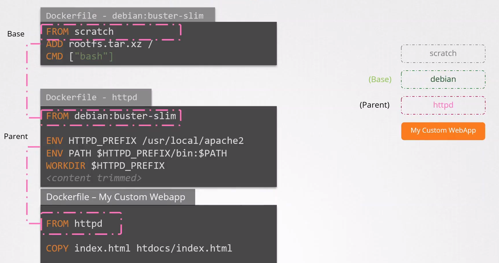
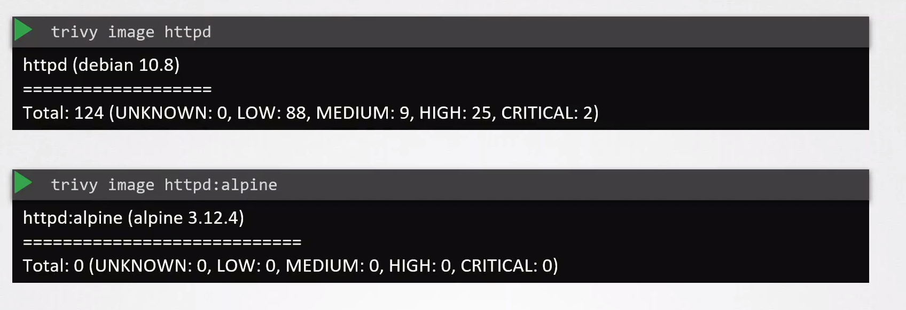

# Minimize Base Image Footprint

  - Take me to [Video Tutorial](https://kodekloud.com/topic/minimize-base-image-footprint/)

In this section, we will take a look at `Minimize Base Image Footprint`.

### Base VS parent image

- The httpd image itself is built from another image which happens to be the Debian image.

- So the httpd image starts with the Debian image and then builds on to installing httpd on it.

- The Debian image is built from SCRATCH. When an image is built from scratch it is called as the base image.

  

### Some of the best practices to be followed while building an image

  - Do not build images that combine multiple applications – such as a web server, database or other services all into one image.

  - Not storing stored data or state inside a container. This is because containers are ephemeral in nature.

  - You must look for images with authenticity. The official image or verified publisher tag indicates the image is from an official sources.

  - Create slim/minimal images.

  - Only install necessary packages.

  - Maintain different images for different environments:

      - Development - debug tools
      - Production

  - Use multi-stage builds.

A minimal image is also less vulnerable to attack. For example a quick scan of vulnerability run on an httpd image using the trivy tool shows that there are atleast124 known vulnerabilities in it. But when run on an httpd alpine based image, we see that there are 0 vulnerabilities. The lesser packages there are within an image, the fewer vulnerabilities are.

    trivy image httpd

    trivy image httpd:alpine
  
