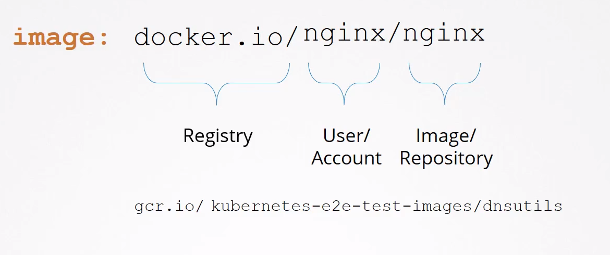
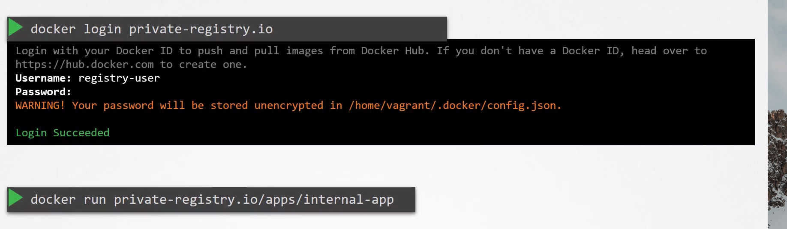
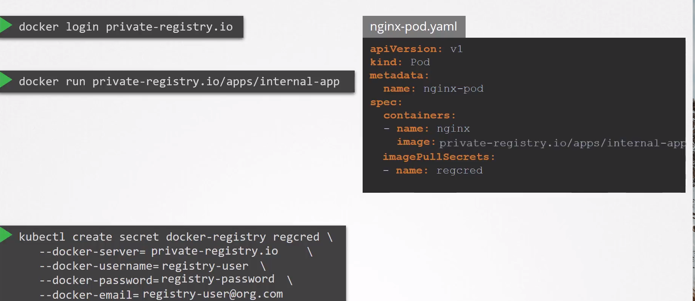

# Image Security

  - Take me to the [Video Tutorial](https://kodekloud.com/topic/image-security-2/)

In this section, we will take a look at `Image Security`.

nginx-pod.yml

    apiVersion: v1
    kind: Pod
    metadata:
      name: nginx
    spec:
      containers:
      - image: nginx
        name: nginx

From the previous `nginx-pod.yml`:

  - the name of the image/repository is nginx

  - the user account here is nginx

  - the image is pulled from the default registry **`docker.io`**

  

There are many registries like google gcr **`gcr.io`**

When you have an application built in house, you should host an internal private registry.

GCP, Azure provide a private registry for your cloud account by default

### From docker respective, to run a container using a private image:

  - You should login first to the private registry

        docker login private-registry.io

  - Then, Run your application

        docker run private-registry.io/apps/internal-app

      

### From Kubernetes respective, Pull an image from private registry:

  Create a secret object with the Creds

    kubectl create secret docker-registry regcred --docker-server=<your-registry-server> --docker-username=<your-name> --docker-password=<your-pword> --docker-email=<your-email>

  Inside the pod definition, specify the imagePullSecrets with the regcred secret

    apiVersion: v1
    kind: Pod
    metadata:
      name: nginx
    spec:
      containers:
      - image: private-registry.io/apps/internal-app
        name: nginx
      imagePullSecrets:
      - name: regcred

  
