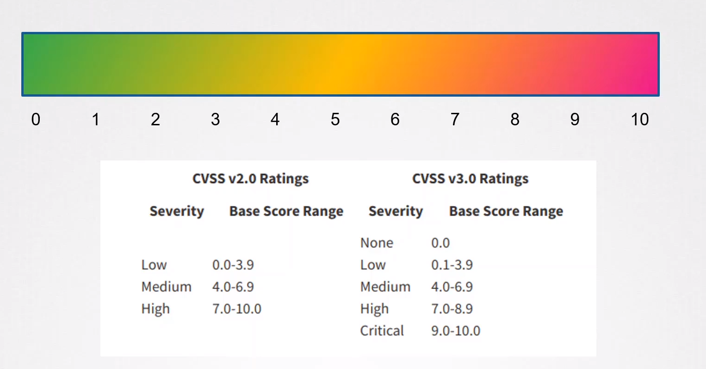
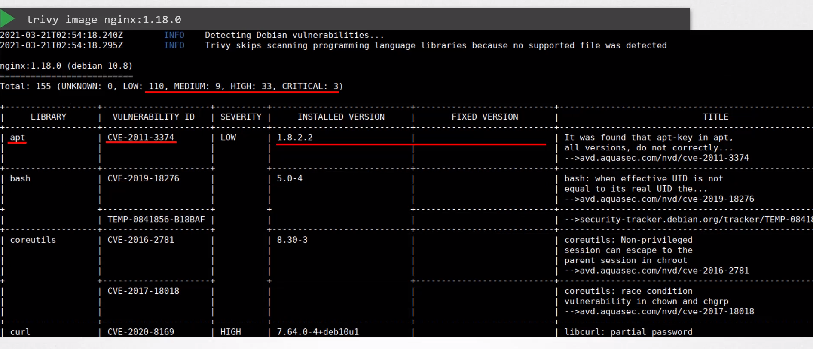

# Scan images for known vulnerabilities (Trivy)

  - Take me to the [Video Tutorial](https://kodekloud.com/topic/scan-images-for-known-vulnerabilities-trivy/)

In this section, we will take a look at `Scan images for known vulnerabilities (Trivy)`.

  - CVE is short for Common Vulnerabilities and Exposures.

  - Each CVE gets what is called a severity score for severity rating (between 0 to 10 or None, Low, Medium, High, Critical).

  

  - Container scanners look for vulnerabilities in the execution environment. More specifically, such a scanner looks at applications included in that container and tells you what vulnerabilities they are known to have. So, for example, it seems that you have nginx version 1.14.2 in there. Based on this version, it can then tell you a list of known vulnerabilities for that particular version.

  - **`Trivy`** is a simple and comprehensive vulnerability scanner for containers and other artifacts. A software vulnerability is a glitch, flaw, or weakness present in the software or in an Operating System. Trivy detects vulnerabilities of OS packages (Alpine, RHEL, CentOS, etc.) and application dependencies (Bundler, Composer, npm, yarn, etc.). Trivy is easy to use. Just install the binary and you're ready to scan. All you need to do for scanning is to specify a target such as an image name of the container.

### Install trivy on Debian/Ubuntu

    sudo apt-get install wget apt-transport-https gnupg lsb-release
    wget -qO - https://aquasecurity.github.io/trivy-repo/deb/public.key | sudo apt-key add -
    echo deb https://aquasecurity.github.io/trivy-repo/deb $(lsb_release -sc) main | sudo tee -a /etc/apt/sources.list.d/trivy.list
    sudo apt-get update
    sudo apt-get install trivy

### Scan the image nginx:1.18.0

    trivy image nginx:1.18.0

  

###  Scan the image nginx:1.18.0 in the tar format

    docker save nginx:1.18.0 > nginx.tar

    trivy image --input nginx.tar 

### References

- https://cve.mitre.org/

- https://github.com/aquasecurity/trivy
