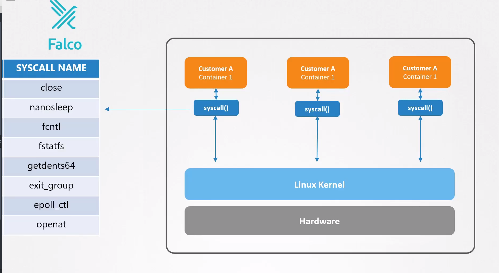

# Perform behavioral analytics of syscall process

  - Take me to the [Video Tutorial](https://kodekloud.com/topic/perform-behavioral-analytics-of-syscall-process/)

In this section, we will take a look at `Perform behavioral analytics of syscall processes`.

  - It might seem that if an attacker already got into our systems, it's already too late and all is lost. However, this may not necessarily be true.

  - The sooner we find out about something that went wrong, the better it is.

  - Falco, the cloud-native runtime security project, is the de facto Kubernetes threat detection engine.

  - In the earlier sections of the course, we learned about syscalls in detail and saw how tools like strace and aquasec tracee can be used to analyze the syscalls that are used by the application inside a pod. When we have hundreds of applications running on several hundred pods generating thousands of syscalls. It is quite meaningless to just monitor the syscalls. What we need is a way to analyze the syscalls and filter events that are suspicious. falco can capture this event and then send alerts using various notification channels.

  

## References

- https://falco.org/
