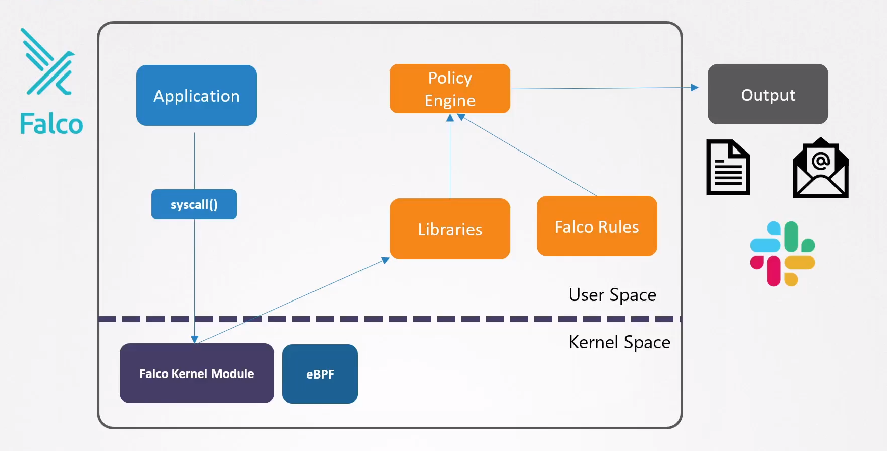

# Falco Overview and Installation

  - Take me to the [Video Tutorial](https://kodekloud.com/topic/falco-overview-and-installation-2/)

In this section, we will take a look at `Falco Overview and Installation`.

  - Falco needs to see what system calls are coming through from the applications in the user space into the Linux kernel. That means it somehow has to insert itself into the kernel, to "sit in the middle" and see what's coming in. One way Falco does this is by making use of a **`Kernel Module`**.

  -  Falco can also interact with the kernel through what is called **`eBPF`** or the extended berkeley packet filter.

  - The system calls are then analyzed by the sysdig libraries in the user space.

  - The events are then filtered by the **`Falco Policy engine`** by making use of predefined rules that can detect whether the event was suspicious or not.

  Such an event is then alerted via outputs such as syslog files, standard output or alerts to other programs' email alerts. Slack channel alerts,...etc.

  

### Installing Falco as a package

  Trust the falcosecurity GPG key, configure the apt repository, and update the package list:

    curl -s https://falco.org/repo/falcosecurity-3672BA8F.asc | apt-key add -
    echo "deb https://download.falco.org/packages/deb stable main" | tee -a /etc/apt/sources.list.d/falcosecurity.list
    apt-get update -y

  Install kernel headers:

    apt-get -y install linux-headers-$(uname -r)

  Install Falco:

    apt-get install -y falco

  start the falco service

    systemctl start falco

### Installing As a daemonsets

    helm repo add falcosecurity https://falcosecurity.github.io/charts
    helm repo update
    helm install falco falcosecurity/falco

### References

- https://falco.org/docs/getting-started/installation/

- https://github.com/falcosecurity/charts/tree/master/falco#introduction
