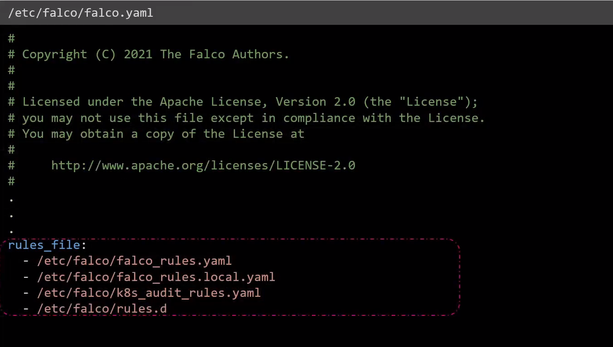
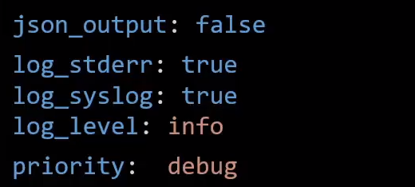

# Falco Configuration Files
  - Take me to [Video Tutorial](https://kodekloud.com/courses/1378608/lectures/31792759)

In this section, we will take a look at Falco Configuration Files

- The main falcoconfiguration file is a YAML file which is located at **`/etc/falco/falco.yaml`**. And it is this configuation file that falco uses when it starts up.

- This YAML file consists of all the configuration options used by Falco -such as the location of the rules that it uses, various formatting options used for log and output messages, the output channels to be configured e.t.c

- The built-in rules that we saw in action in the previous lecture are stored inside the **`/etc/falco/falco_rules.yaml`** file and you can see that it is first in this list

  

### Some of **`/etc/falco/falco.yaml`** options

- The JSON Output field when enabled, logs the events in JSON. By default this field is set to false and logs events as text.

- Then we have configuration options related to Falco itself. Such as logging options for the falco process such as whether to log to standard error   or to syslog and the log level to be used for falcos logs. These are not to be confused with the PRIORITY that we used for individual rules.

- The log level is specific for the logs generated for falco itself.

- The priority field however, is related to Falco rules. This is the minimum priority level that Falco will use to log events. So anything with a higher priority will be logged and anything under the set priority will not be logged by falco.

- program_output If enabled is set to true, Falco alerts will be sent to a program

  

### Reference

https://falco.org/docs/configuration/
