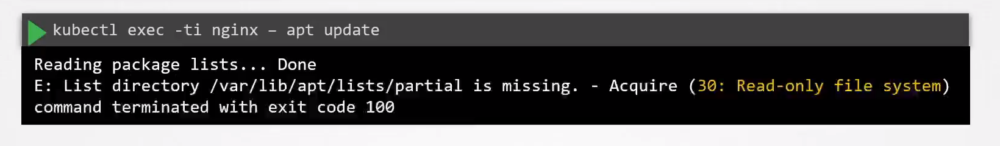

# Ensure Immutability of Containers at Runtime

  - Take me to the [Video Tutorial](https://kodekloud.com/topic/ensure-immutability-of-containers-at-runtime/)

In this section, we will take a look at `how to Ensure Immutability of Containers at Runtime`.

-  Although containers are meant to be immutable by default, we can carry out in-place updates on them.

- Now, this can be done in a number of different ways – such as copying files directly into the pod or getting a shell into the container and making changes e.t.c.

  `docker cp nginx.conf nginx:/etc/nginx`

  Or

  `kubectl exec -it nginx -- apt update`

- To prevent this, make sure that we cannot write to the file system once the pod is started.

- To do this we can use **`security contexts`** with **`readOnlyRootFilesystem=true`**. 

### Nginx with readOnlyRootFilesystem=true to ensure the immutability

Manifest file for `nginx.yaml` as follows:

    apiVersion: v1
    kind: Pod
    metadata:
      labels:
        run: nginx
      name: nginx
    spec:
      containers:
      - image: nginx
        name: nginx
        securityContext:
          readOnlyRootFilesystem: true
        volumeMounts:
        - name: cache-volume
          mountPath: /var/cache/nginx
        - name: runtime-volume
          mountPath: /var/run
      volumes:
        - name: cache-volume
          emptyDir: {}
        - name: runtime-volume
          emptyDir: {}

create resource from `nginx.yaml` file:

      kubectl create -f nginx.yaml

Test the immutability

    kubectl exec -it nginx -- apt update

  

