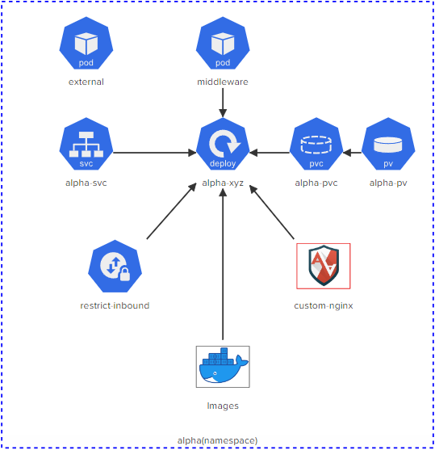

# CKS Challenge 1

[Take me to the lab!](https://kodekloud.com/topic/lab-challenge-1/)

Please note that the competition status for CKS Challenges is ended. Please do not submit a solution. It will not be scored.

# Challenge

There are 6 images listed in the diagram. Using `Aquasec Trivy` (which is already installed on the controlplane node), identify the image that has the least number of critical vulnerabilities and use it to deploy the `alpha-xyz` deployment.

Secure this deployment by enforcing the AppArmor profile called `custom-nginx`.

Expose this deployment with a ClusterIP type service and make sure that only incoming connections from the pod called `middleware` is accepted and everything else is rejected.

Click on each icon (in the lab) to see more details. Once done, click the Check button to test your work.



Do the tasks in this order:

1.  <details>
    <summary>namespace</summary>

    All the action is taking place in the `alpha` namespace

    ```
    kubectl config set-context --current --namespace alpha
    ```

1.  <details>
    <summary>alpha-pv</summary>

    * A persistentVolume called `alpha-pv` has already been created. Do not modify it. Inspect the parameters used to create it.

    ```bash
    kubectl describe pv alpha-pv
    ```

    Note `StorageClass`, `Access Modes`, `Capacity`, `VolumeMode`

    </details>

1.  <details>
    <summary>alpha-pvc</summary>

    * `alpha-pvc` should be bound to `alpha-pv`. Delete and Re-create it if necessary.

    ```
    kubectl get pvc alpha-pvc
    ```

    > Status is pending, i.e it wont bind.

    Delete the PVC and recreate it with values for storage class, access modes and capacity matching those of the PV

    ```yaml
    apiVersion: v1
    kind: PersistentVolumeClaim
    metadata:
    name: alpha-pvc
    namespace: alpha
    spec:
      accessModes:
      - ReadWriteMany
      resources:
        requests:
          storage: 1Gi
      storageClassName: local-storage
      volumeMode: Filesystem
    ```

    </details>

1.  <details>
    <summary>images</summary>

    * Permitted images are: `nginx:alpine`, `bitnami/nginx`, `nginx:1.13`, `nginx:1.17`, `nginx:1.16`and `nginx:1.14`. Use `trivy` to find the image with the least number of `CRITICAL` vulnerabilities.

    1. Inspect all images

        ```
        docker image ls
        ```

        Note there are additional images other than those stated

    1.  Loop over the images we want (by filtering out those we don't), and trivy them getting the information we need

        ```bash
        for i in $(docker image ls --format '{{.Repository}}:{{.Tag}}' | grep nginx | grep -v none)
        do
            echo -n "$i "
            trivy i -s CRITICAL $i | grep Total | awk '{print $2}'
        done
        ```

        >   nginx:alpine 0<br/>
            bitnami/nginx:latest 3<br/>
            nginx:latest 27<br/>
            nginx:1.17 43<br/>
            nginx:1.16 43<br/>
            nginx:1.14 64<br/>
            nginx:1.13 85

        We can see that `nginx:alpine` has the least (zero) criticals, which is kind of as expected! We will use this image when we come to deploy the pod later.

    </details>


1.  <details>
    <summary>custom-nginx</summary>

    * Move the AppArmor profile `/root/usr.sbin.nginx` to `/etc/apparmor.d/usr.sbin.nginx` on the controlplane node
    * Load the AppArmor profile called `custom-nginx` and ensure it is enforced.

    <br/>

    1.  ```bash
        mv /root/usr.sbin.nginx /etc/apparmor.d/usr.sbin.nginx
        ```
    1.  ```bash
        apparmor_parser /etc/apparmor.d/usr.sbin.nginx
        ```

    </details>

1.  <details>
    <summary>alpha-xyz</summary>

    * Create a deployment called `alpha-xyz` that uses the image with the least 'CRITICAL' vulnerabilities? (Use the sample YAML file located at `/root/alpha-xyz.yaml` to create the deployment. Please make sure to use the same names and labels specified in this sample YAML file!)
    * Deployment has exactly `1` ready replica
    * `data-volume` is mounted at `/usr/share/nginx/html` on the pod
    * `alpha-xyz` deployment uses the `custom-nginx` apparmor profile (applied to container called `nginx`). Note that this task is revealed by clicking the arrow between `custom-nginx` and `alpha-xyz`

    <br/>

    Edit the given file `/root/alpha-xyz.yaml` and fill in the necessary properties. We need to use the PVC from step 3, the image determined in step 4 and the apparmor profile from step 5

    ```yaml
    apiVersion: apps/v1
    kind: Deployment
    metadata:
      creationTimestamp: null
      labels:
        app: alpha-xyz
      name: alpha-xyz
      namespace: alpha
    spec:
      replicas: 1
      selector:
        matchLabels:
          app: alpha-xyz
      strategy: {}
      template:
        metadata:
          annotations:
            container.apparmor.security.beta.kubernetes.io/nginx: localhost/custom-nginx
          labels:
            app: alpha-xyz
        spec:
          volumes:
          - name: data-volume
            persistentVolumeClaim:
              claimName: alpha-pvc
          containers:
          - image: nginx:alpine
            name: nginx
            volumeMounts:
            - name: data-volume
              mountPath: /usr/share/nginx/html
    ```

    ```bash
    kubectl apply -f /root/alpha-xyz.yaml
    ```

    </details>

1.  <details>
    <summary>alpha-svc</summary>

    * Expose the `alpha-xyz` as a `ClusterIP` type service called `alpha-svc`
    * `alpha-svc` should be exposed on `port: 80` and `targetPort: 80`

    <br/>

    ```bash
    kubectl expose deployment alpha-xyz --type ClusterIP --name alpha-svc --port 80 --target-port 80
    ```

1.  <details>
    <summary>restrict-inbound</summary>

    * Create a NetworkPolicy called `restrict-inbound` in the `alpha` namespace
    * Policy Type = `Ingress`
    * Inbound access only allowed from the pod called `middleware` with label `app=middleware`
    * Inbound access only allowed to TCP port 80 on pods matching the policy
    * Policy should be only applied on pods with label `app=alpha-xyz`. This task is revealed by clicking the arrow between `restrict-inbound` and `alpha-xyz`

    ```yaml
    apiVersion: networking.k8s.io/v1
    kind: NetworkPolicy
    metadata:
      name: restrict-inbound
      namespace: alpha
    spec:
      podSelector:
        matchLabels:
          app: alpha-xyz
      policyTypes:
        - Ingress
      ingress:
        - from:
            - podSelector:
                matchLabels:
                  app: middleware
          ports:
            - port: 80
    ```

    Apply this policy


Once all the above tasks are completed, click the `Check` button.

# Automate the lab in a single script!

As DevOps engineers, we love everything to be automated!

<details>
<summary>Automation Script</summary>

Paste this entire script to the lab terminal, sit back and enjoy!<br/>
When the script completes, you can press the `Check` button and the lab will be complete!


```bash
# CKS challenge 1
{
start_time=$(date '+%s')

# Set namespace
kubectl config set-context --current --namespace alpha

# Fix PVC
kubectl delete pvc alpha-pvc

cat <<EOF | kubectl create -f -
apiVersion: v1
kind: PersistentVolumeClaim
metadata:
  name: alpha-pvc
  namespace: alpha
spec:
  accessModes:
  - ReadWriteMany
  resources:
    requests:
      storage: 1Gi
  storageClassName: local-storage
  volumeMode: Filesystem
EOF

kubectl wait --for=jsonpath='{.status.phase}'=Bound pvc/alpha-pvc --timeout=30s

# Find image with least vulnerabilites
img=''
vuln=10000

for i in $(docker image ls --format '{{.Repository}}:{{.Tag}}' | grep nginx | grep -v none)
do
    crit=$(trivy i -s CRITICAL $i | grep Total | awk '{print $2}')
    [ $crit -lt $vuln ] && vuln=$crit && img=$i
done

# Set up apparmor
mv /root/usr.sbin.nginx /etc/apparmor.d/usr.sbin.nginx
apparmor_parser /etc/apparmor.d/usr.sbin.nginx

# Create deployment with selected image

cat << EOF | kubectl create -f -
apiVersion: apps/v1
kind: Deployment
metadata:
  creationTimestamp: null
  labels:
    app: alpha-xyz
  name: alpha-xyz
  namespace: alpha
spec:
  replicas: 1
  selector:
    matchLabels:
      app: alpha-xyz
  strategy: {}
  template:
    metadata:
      annotations:
        container.apparmor.security.beta.kubernetes.io/nginx: localhost/custom-nginx
      labels:
        app: alpha-xyz
    spec:
      volumes:
      - name: data-volume
        persistentVolumeClaim:
          claimName: alpha-pvc
      containers:
      - image: $img
        name: nginx
        volumeMounts:
        - name: data-volume
          mountPath: /usr/share/nginx/html
EOF

kubectl wait deployment -n alpha alpha-xyz --for condition=Available=True --timeout=30s

# Expose deployment
kubectl expose deployment alpha-xyz --type ClusterIP --name alpha-svc --port 80 --target-port 80

# Create netpol
cat << EOF | kubectl create -f -

apiVersion: networking.k8s.io/v1
kind: NetworkPolicy
metadata:
  name: restrict-inbound
  namespace: alpha
spec:
  podSelector:
    matchLabels:
      app: alpha-xyz
  policyTypes:
    - Ingress
  ingress:
    - from:
        - podSelector:
            matchLabels:
              app: middleware
      ports:
        - port: 80
EOF

end_time=$(date '+%s')
duration=$(( end_time - start_time ))
echo "Complete in ${duration}s"

}
```

</details>
