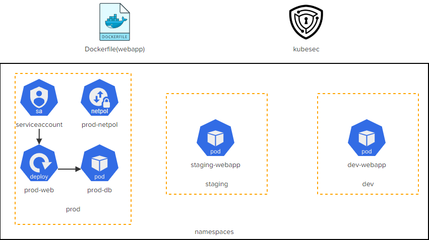

# CKS Challenge 2

[Take me to the lab!](https://kodekloud.com/topic/lab-challenge-2/)

Please note that the competition status for CKS Challenges is ended. Please do not submit a solution. It will not be scored.

# Challenge

A number of applications have been deployed in the `dev`, `staging` and `prod` namespaces. There are a few security issues with these applications.

Inspect the issues in detail by clicking on the icons of the interactive architecture diagram in the lab and complete the tasks to secure the applications. Once done click on the Check button to validate your work.



Do the tasks in this order:

1.  <details>
    <summary>dockerfile</summary>

    * Run as non root(instead, use correct application user)
    * Avoid exposing unnecessary ports
    * Avoid copying the `Dockerfile` and other unnecessary files and directories in to the image. Move the required files and directories (app.py, requirements.txt and the templates directory) to a subdirectory called `app` under `webapp` and update the COPY instruction in the `Dockerfile` accordingly.
    * Once the security issues are fixed, rebuild this image locally with the tag `kodekloud/webapp-color:stable`

    The first two subtasks involve cleaning the Dockerfile...

    ```bash
    cd /root/webapp
    vi Dockerfile
    ```

    Change the Dockerfile thus:

    1. We are asked to move the application to subdirectory `app`, so change to `COPY` instruction in anticipation of this

        ```
        COPY ./app /opt
        ```

    1. Run as non root

        A user has been created with `RUN adduser -D worker`, but we are not switching to it, but are instead switching to `root`.

        Change the line `USER root` to `USER worker`


    1. Avoid exposing unnecessary ports. We don't need port 22 (SSH) for the app, so delete the following lines

        ```
        ## Expose port 22
        EXPOSE 22
        ```

        Now save and exit `vi`

    1. Move the app and related files to a new subdirectory `app`

        ```bash
        mkdir app
        mv app.py app/
        mv requirements.txt app/
        mv templates app/
        ```

    1. Rebuild image

        ```bash
        docker build -t kodekloud/webapp-color:stable .
        ```

    1. Return to home directory

        ```bash
        cd ~
        ```

    </details>

1.  <details>
    <summary>kubesec</summary>

    * Fix issues with the `/root/dev-webapp.yaml` file which was used to deploy the `dev-webapp` pod in the `dev` namespace.
    * Redeploy the `dev-webapp` pod once issues are fixed with the image `kodekloud/webapp-color:stable`
    * Fix issues with the `/root/staging-webapp.yaml` file which was used to deploy the `staging-webapp` pod in the `staging` namespace.
    * Redeploy the `staging-webapp` pod once issues are fixed with the image `kodekloud/webapp-color:stable`

    <br/>

    When running `kubesec` we can use `jq` to extract the part of the JSON output that's relevant to identifying critical issues with the scanned manifest. Run without `| jq` and everything after to see the whole report.

    1. `dev-webapp.yaml`

        1.  ```bash
            kubesec scan /root/dev-webapp.yaml | jq '.[] | .scoring.critical'
            ```

            Note that `CapSysAdmin` and `AllowPrivilegeEscalation` are called out.

        1.  Edit the manifest:
            1. Remove the `SYS_ADMIN` capability
            1. Set `allowPrivilegeEscalation` to `false`
            1. Set the container's image to `kodekloud/webapp-color:stable` (which we built earlier)

        1.  Don't recreate the pod yet. There's more to do in the next stage.

    1. `staging-webapp.yaml`

        1.  ```bash
            kubesec scan /root/dev-webapp.yaml | jq '.[] | .scoring.critical'
            ```

        1.  Note that this has exactly the same issues as `dev-webapp.yaml`. Perform exactly the same steps as for `staging-webapp.yaml`.

    </details>

1.  <details>
    <summary>dev-webapp</summary>

    Ensure that the pod `dev-webapp` is immutable:

    * This pod can be accessed using the `kubectl exec` command. We want to make sure that this does not happen. Use a startupProbe to remove all shells before the container startup. Use `initialDelaySeconds` and `periodSeconds` of `5`. Hint: For this to work you would have to run the container as root!
    * Image used: `kodekloud/webapp-color:stable` (We have already done this above)
    * Redeploy the pod as per the above recommendations and make sure that the application is up.

    1.  Check what shells are present in the container - shell commands are found in `/bin` directory and usually end with `sh`, e.g. `sh` itself, `bash` etc.

        ```
        kubectl exec -n dev dev-webapp -- ls /bin | grep sh
        ```

        Output:

        > ash<br/>fdflush<br/>sh

        `fdflush` isn't a shell, but the other two are. `ash` is a shell normally packaged with Alpine Linux.

    1. Create a startup probe according to the specification, and ensure the startup probe can run as root. Note that the probes aren't affected by the `USER` command in the Dockerfile.

        1. Edit `dev-webapp.yaml`
        1. Add the following under `securityContext`, if it is not already there

            ```yaml
            runAsUser: 0
            ```
        1. Insert the probe

        ```yaml
        startupProbe:
          exec:
            command:
            - rm
            - /bin/sh
            - /bin/ash
          initialDelaySeconds: 5
          periodSeconds: 5
        ```

    1. Now recreate the running pod with everything we changed in step 2 and this step

        ```
        kubectl replace -f dev-webapp.yaml --force
        ```

    </details>

1.  <details>
    <summary>staging-webapp</summary>

    Ensure that the pod `dev-webapp` is immutable:

    * This pod can be accessed using the `kubectl exec` command. We want to make sure that this does not happen. Use a startupProbe to remove all shells before the container startup. Use `initialDelaySeconds` and `periodSeconds` of `5`. Hint: For this to work you would have to run the container as root!
    * Image used: `kodekloud/webapp-color:stable` (We have already done this above)
    * Redeploy the pod as per the above recommendations and make sure that the application is up.

    <br/>

    Follow the same steps as for `dev-webapp` above, adjust `staging-webapp.yaml` and recreate the pod.

    </details>

1.  <details>
    <summary>prod-web</summary>

    * The deployment has a secret hardcoded. Instead, create a secret called `prod-db` for all the hardcoded values and consume the secret values as environment variables within the deployment.

    <br/>

    1.  Examine the deployment manifest to see what this secret is

        ```
        kubectl get deployment -n prod prod-web -o yaml
        ```

        We can see there are 3 environment variables with values.

    1.  Create a secret for these vars

        ```
        kubectl create secret generic prod-db -n prod \
            --from-literal DB_Host=prod-db \
            --from-literal DB_User=root \
            --from-literal DB_Password=paswrd
        ```

    1.  Edit the deployment and change the `env` section to get the values from the secret

        ```
        kubectl edit deployment -n prod prod-web
        ```

        Replace the variables under the `env` block with

        ```yaml
            - name: DB_User
              valueFrom:
                secretKeyRef:
                  key: DB_User
                  name: prod-db
            - name: DB_Host
              valueFrom:
                secretKeyRef:
                  key: DB_Host
                  name: prod-db
            - name: DB_Password
              valueFrom:
                secretKeyRef:
                  key: DB_Password
                  name: prod-db
        ```

    1.  Test this by pressing the `prod-web` button above the terminal. After you apply the network policy next, this will no longer work

    </details>

1.  <details>
    <summary>prod-netpol</summary>

    * Use a network policy called `prod-netpol` that will only allow traffic only within the `prod` namespace. All the traffic from other namespaces should be denied.

    <br/>

    Note that all namespaces have a predefined label `kubernetes.io/metadata.name` which is very useful when creating namespace-restricted network policies.

    ```yaml
    apiVersion: networking.k8s.io/v1
    kind: NetworkPolicy
    metadata:
      name: prod-netpol
      namespace: prod
    spec:
      podSelector: {}       # apply to all pods in prod namespace
      policyTypes:
        - Ingress
      ingress:
        - from:
            - podSelector: {}                        # any pod...
              namespaceSelector:
                matchLabels:
                  kubernetes.io/metadata.name: prod  # ...that is only in prod namespace
    ```
    </details>

Once all the above tasks are completed, click the `Check` button.

# Automate the lab in a single script!

As DevOps engineers, we love everything to be automated!

<details>
<summary>Automation Script</summary>

Paste this entire script to the lab terminal, sit back and enjoy!<br/>
When the script completes, you can press the `Check` button and the lab will be complete!


```bash

{
start_time=$(date '+%s')

## Dockerfile
echo "Prep application for container"
cd ~/webapp
mkdir app
mv app.py app/
mv requirements.txt app/
mv templates app/

echo "Sanitizing Dockerfile"
cat <<EOF > prog.sed
s/COPY \./COPY .\/app/
/EXPOSE 22/d
s/USER root/USER worker/
EOF

sed -i -f prog.sed Dockerfile

docker build -t kodekloud/webapp-color:stable .

cd ~

## kubesec
# Run kubesec manually, need to remove cap SYS_ADMIN and allowPrivilegeEscalation
echo "Issues in dev-webapp.yaml"
kubesec scan /root/dev-webapp.yaml | jq '.[] | .scoring.critical'
echo "Issues in staging-webapp.yaml"
kubesec scan /root/staging-webapp.yaml | jq '.[] | .scoring.critical'

## Fix kubesec issues in the local files
echo "Fixing these files"
cat <<EOF > prog.sed
/SYS_ADMIN/d
/allowPrivilegeEscalation/d
EOF

sed -i -f prog.sed /root/dev-webapp.yaml
sed -i -f prog.sed /root/staging-webapp.yaml


## Staging

kubectl delete pod -n staging staging-webapp --grace-period 0 --force

cat <<EOF | kubectl create -f -
apiVersion: v1
kind: Pod
metadata:
  labels:
    name: staging-webapp
  name: staging-webapp
  namespace: staging
spec:
  nodeName: controlplane
  containers:
  - env:
    - name: APP_COLOR
      value: pink
    image: kodekloud/webapp-color:stable
    imagePullPolicy: IfNotPresent
    name: webapp-color
    resources: {}
    securityContext:
      capabilities:
        add:
        - NET_ADMIN
      runAsUser: 0
    startupProbe:
      exec:
        command:
        - rm
        - /bin/sh
        - /bin/ash
      initialDelaySeconds: 5
      periodSeconds: 5
EOF

kubectl wait pods -n staging -l name=staging-webapp --for condition=Ready --timeout=90s

## dev

kubectl delete pod -n dev dev-webapp --grace-period 0 --force

cat <<EOF | kubectl create -f -
apiVersion: v1
kind: Pod
metadata:
  labels:
    name: dev-webapp
  name: dev-webapp
  namespace: dev
spec:
  nodeName: controlplane
  containers:
  - env:
    - name: APP_COLOR
      value: darkblue
    image: kodekloud/webapp-color:stable
    imagePullPolicy: Never
    name: webapp-color
    resources: {}
    securityContext:
      capabilities:
        add:
        - NET_ADMIN
      runAsUser: 0
    startupProbe:
      exec:
        command:
        - rm
        - /bin/sh
        - /bin/ash
      initialDelaySeconds: 5
      periodSeconds: 5
EOF

kubectl wait pods -n dev -l name=dev-webapp --for condition=Ready --timeout=90s


# prod web
# Cheat to get pod name
pod=$(kubectl get pod -n prod  | grep prod-web | cut -d ' ' -f 1)
secrets=''
for secret in $(kubectl get po -n prod $pod -o json | jq -r '.spec.containers[0].env | .[] | [.name, .value] | @csv' | tr -d  '"' | tr ',' '=')
do
    secrets="$secrets --from-literal=$secret"
done

kubectl create secret generic prod-db -n prod $secrets

# Patch environment to get secret keys
kubectl patch deployment -n prod prod-web --type json \
  -p '[{"op": "remove", "path": "/spec/template/spec/containers/0/env"},{"op": "add", "path": "/spec/template/spec/containers/0/env", "value": [{"name":"DB_User","valueFrom":{"secretKeyRef":{"key":"DB_User","name":"prod-db"}}},{"name":"DB_Host","valueFrom":{"secretKeyRef":{"key":"DB_Host","name":"prod-db"}}},{"name":"DB_Password","valueFrom":{"secretKeyRef":{"key":"DB_Password","name":"prod-db"}}}]}]'

# Wait for rollout
kubectl rollout status deployment -n prod prod-web --timeout=90s

## Prod netpol
cat <<EOF | kubectl create -f -
apiVersion: networking.k8s.io/v1
kind: NetworkPolicy
metadata:
  name: prod-netpol
  namespace: prod
spec:
  podSelector: {}
  policyTypes:
    - Ingress
  ingress:
    - from:
        - podSelector: {}
          namespaceSelector:
            matchLabels:
              kubernetes.io/metadata.name: prod
EOF

end_time=$(date '+%s')
duration=$(( end_time - start_time ))
echo "Complete in ${duration}s"
}
```

</details>