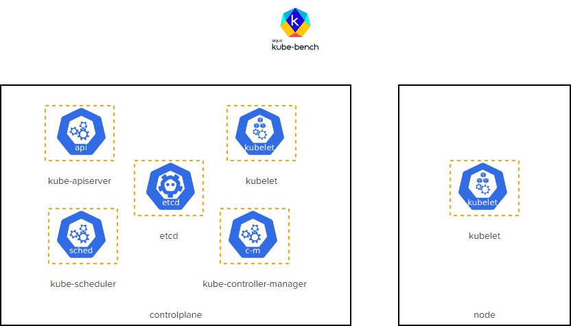

# CKS Challenge 3

[Take me to the lab!](https://kodekloud.com/topic/lab-challenge-3/)

Please note that the competition status for CKS Challenges is ended. Please do not submit a solution. It will not be scored.

# Challenge

This is a two node kubernetes cluster. Using the `kube-bench` utility, identify and fix all the issues that were reported as failed for the `controlplane` and the `worker node` components.

Inspect the issues in detail by clicking on the icons of the interactive architecture diagram on the right and complete the tasks to secure the cluster. Once done click on the `Check` button to validate your work.

Click on each icon (in the lab) to see more details. Once done, click the Check button to test your work.



Do the tasks in this order:


1.  <details>
    <summary>kube-bench</summary>

    * Download `kube-bench` from AquaSec and extract it under `/opt` filesystem. Use the appropriate steps from the kube-bench docs to complete this task.
    * Run `kube-bench` with config directory set to `/opt/cfg` and `/opt/cfg/config.yaml` as the config file. Redirect the result to `/var/www/html/index.html` file.


    When this challenge was created, `v0.6.2` of kube-bench was current, so we will download that version for best compatibility.

    1.  Download and place under `opt`

        ```bash
        curl -L https://github.com/aquasecurity/kube-bench/releases/download/v0.6.2/kube-bench_0.6.2_linux_amd64.tar.gz | tar -xz -C /opt
        ```

    1.  Run it
        1. Create directory for report

            ```bash
            mkdir -p /var/www/html
            ```

        1. Execute with given configuration instructions

            ```bash
            /opt/kube-bench --config-dir /opt/cfg --config /opt/cfg/config.yaml > /var/www/html/index.html
            ```

    Despite the fact that we redirected the output to `index.html`, the file content is text and can be inspected like this

    ```bash
    less /var/www/html/index.html
    ```

    </details>

1.  <details>
    <summary>kubelet (node)</summary>

    * Ensure that the `--protect-kernel-defaults` argument is set to true (node01)

    1. `ssh` to `node01`

        ```bash
        ssh node01
        ```

    1. Edit the kubelet configuration

        ```bash
        vi /var/lib/kubelet/config.yaml
        ```

    1. Add the following line to the end of the file

        ```yaml
        protectKernelDefaults: true
        ```

    1.  Save and exit `vi`, then restart kubelet

        ```
        systemctl restart kubelet
        ```

    1.  Return to `controlplane` node

        ```bash
        exit
        ```

    </details>

1.  <details>
    <summary>kubelet (controlplane)</summary>

    * Ensure that the `--protect-kernel-defaults` argument is set to true (node01)

    <br/>

    Do exactly the same as above, but this time you don't need to `ssh` to anywhere first.

    </details>

1.  <details>
    <summary>kube-controller-mananger</summary>

    * Ensure that the `--profiling argument` is set to false

    1.  Edit the manifest

        ```bash
        vi /etc/kubernetes/manifests/kube-controller-manager.yaml
        ```

    1.  Add the following to the list of arguments in the `command` section of the pod spec:

        ```yaml
            - --profiling=false
        ```

    1. Save and exit from `vi`. Controller manager pod will restart in a minute or so


    </details>

1.  <details>
    <summary>kube-scheduler</summary>

    * Ensure that the `--profiling` argument is set to false

    <br/>

    Do the exact same staps as above, but with `/etc/kubernetes/manifests/kube-scheduler.yaml`

    </details>

1.  <details>
    <summary>etcd</summary>

    * Correct the `etcd` data directory ownership

    1. View the report as discussed in the `kube-bench` section above, and find the FAIL at section `1.1.12`
    1. Verify the data directory by checking the `volumes` section of the `etcd` pod static manifest for the `hostPath`.
    1. Correct the ownership as directed

        ```bash
        chown -R etcd:etcd /var/lib/etcd
        ```

    </details>

1.  <details>
    <summary>kube-apiserver</summary>

    * Ensure that the `--profiling` argument is set to `false`
    * Ensure `PodSecurityPolicy` admission controller is enabled
    * Ensure that the `--insecure-port` argument is set to `0`
    * Ensure that the `--audit-log-path` argument is set to `/var/log/apiserver/audit.log`
    * Ensure that the `--audit-log-maxage` argument is set to `30`
    * Ensure that the `--audit-log-maxbackup` argument is set to `10`
    * Ensure that the `--audit-log-maxsize` argument is set to `100`

    <br/>

    So this looks like a bunch of argument changes. Well it is, but there's a bit more work than that. If we tell the apiserver to open a log at a given directory, then that directory is expected to be on the host machine, i.e. `controlplane` itself. This means we also need to create a `volume` and `volumeMount` to satisfy this criterion, and also the host directory must exist.

    1.  The directory into which the log file will go needs to exist first

        ```bash
         mkdir -p /var/log/apiserver
         ```

    1.  Edit the manifest file

        ```bash
        vi /etc/kubernetes/manifests/kube-apiserver.yaml
        ```

    1.  Put in all the new arguments

        ```yaml
            - --profiling=false
            - --insecure-port=0
            - --audit-log-maxage=30
            - --audit-log-maxbackup=10
            - --audit-log-path=/var/log/apiserver/audit.log
            - --audit-log-maxsize=100
        ```

    1.  Enable the admission controller, by appending `PodSecurityPolicy` to the `--enable-admission-plugins` argument so it looks like

        ```yaml
            - --enable-admission-plugins=NodeRestriction,PodSecurityPolicy
        ```

    1.  Create a `volume` for the log file (add to existing `volumes`)

        ```yaml
          volumes:
          - hostPath:
              path: /var/log/apiserver/audit.log
              type: FileOrCreate
            name: audit-log
        ```

    1.  Create a `volumeMount` for this volume (add to existing `volumeMounts`)

        ```yaml
            volumeMounts:
            - mountPath: /var/log/apiserver/audit.log
              name: audit-log
        ```

    1.  Save and exit `vi`. Wait up to a minute for api server to restart. Be aware of how to [debug a crashed apiserver](https://github.com/kodekloudhub/community-faq/blob/main/docs/diagnose-crashed-apiserver.md) if you muck it up!

    </details>

# Automate the lab in a single script!

As DevOps engineers, we love everything to be automated!

<details>
<summary>Automation Script</summary>

Paste this entire script to the lab terminal, sit back and enjoy!<br/>
When the script completes, you can press the `Check` button and the lab will be complete!

```bash
{
start_time=$(date '+%s')

## kube-bench

# Install and run kube-bench
echo 'kube-bench'
curl -L https://github.com/aquasecurity/kube-bench/releases/download/v0.6.2/kube-bench_0.6.2_linux_amd64.tar.gz | tar -xz -C /opt
mkdir -p /var/www/html
/opt/kube-bench --config-dir /opt/cfg --config /opt/cfg/config.yaml > /var/www/html/index.html


## etcd
echo 'etcd'
chown -R etcd:etcd /var/lib/etcd

## kubelet
echo 'kubelet'
echo 'protectKernelDefaults: true' >> /var/lib/kubelet/config.yaml
systemctl restart kubelet
ssh node01 'echo "protectKernelDefaults: true" >> /var/lib/kubelet/config.yaml'
ssh node01 'systemctl restart kubelet'

## kube-controller-mananger
echo 'kube-controller-mananger'
yq -i e '.spec.containers[0].command += "--profiling=false"' /etc/kubernetes/manifests/kube-controller-manager.yaml

## kube-scheduler
echo 'kube-scheduler'
yq -i e '.spec.containers[0].command += "--profiling=false"' /etc/kubernetes/manifests/kube-scheduler.yaml

## kube-apiserver
echo 'kube-apiserver'
# Create audit log path
mkdir -p /var/log/apiserver

# Patch api-server
yq e '.spec.containers[0].command += [
    "--profiling=false",
    "--insecure-port=0",
    "--audit-log-maxage=30",
    "--audit-log-maxbackup=10",
    "--audit-log-path=/var/log/apiserver/audit.log",
    "--audit-log-maxsize=100"
    ] |
    .spec.volumes += {"name": "audit-log", "hostPath":{"path":"/var/log/apiserver/audit.log", "type":"FileOrCreate"}} |
    .spec.containers[0].volumeMounts += {"mountPath": "/var/log/apiserver/audit.log", "name": "audit-log"}' \
    /etc/kubernetes/manifests/kube-apiserver.yaml | \
  sed 's/NodeRestriction/NodeRestriction,PodSecurityPolicy/' > \
  kube-apiserver.yaml.out

# Save current API server container ID
api_container_id=$(crictl ps | grep apiserver | cut -f 1 -d ' ')

mv -f kube-apiserver.yaml.out /etc/kubernetes/manifests/kube-apiserver.yaml

# Kick kubelet - I have seen it not notice the manifest change here.
systemctl restart kubelet

# Shut up warnings from crictl
crictl config \
  --set runtime-endpoint=unix:///var/run/dockershim.sock \
  --set image-endpoint=unix:///var/run/dockershim.sock

# Wait for API server restart (gets a new container ID)
new_id=''

while [ -z "$new_id" -o "$api_container_id" = "$new_id" ]
do
    sleep 2
    new_id=$(crictl ps | grep apiserver | cut -f 1 -d ' ')
    echo "API server container id is $new_id"
done

sleep 5

kubectl get pods -n kube-system

end_time=$(date '+%s')
duration=$(( end_time - start_time ))
echo "Complete in ${duration}s"
}
```

</details>