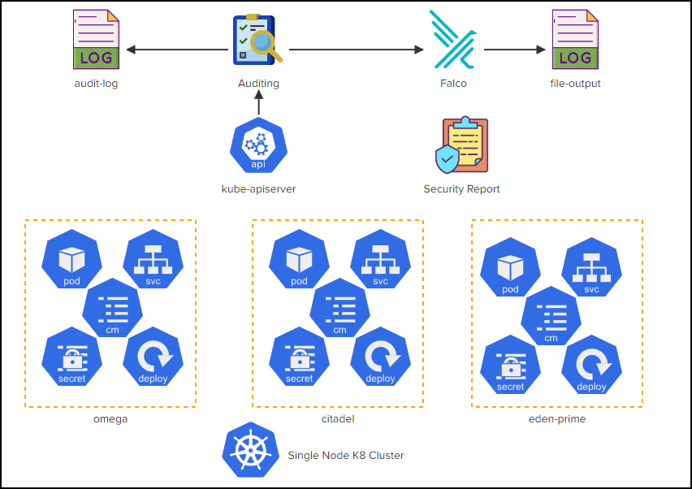

# CKS Challenge 4

[Take me to the lab!](https://kodekloud.com/topic/lab-challenge-4/)

Please note that the competition status for CKS Challenges is ended. Please do not submit a solution. It will not be scored.

# Challenge

There are a number of Kubernetes objects created inside the `omega`, `citadel` and `eden-prime` namespaces. However, several suspicious/abnormal operations have been observed in these namespaces!.

For example, in the `citadel` namespace, the application called `webapp-color` is constantly changing! You can see this for yourself by clicking on the `citadel-webapp` link and refreshing the page every 30 seconds. Similarly there are other issues with several other objects in other namespaces.

To understand what's causing these anomalies, you would be required to configure `auditing` in Kubernetes and make use of the Falco tool.

Inspect the issues in detail by clicking on the icons of the interactive architecture diagram in the lab and complete the tasks to secure the cluster. Once done click on the `Check` button to validate your work.



Do the tasks in this order

1.  <details>
    <summary>Explore the challenge</summary>

    Click on all the icons individually and read the tasks. There is some important information within.

    <details>
    <summary>Reveal</summary>

    The `Deployment` icon in `citadel` namespace yields the following information:

    > Delete the rolebinding causing the constant deletion and creation of the `configmaps` and `pods` in this namespace.

    So, this identifies the objects we need to audit in the next task.

    </details>
    </details>

1.  <details>
    <summary>Auditing/audit-log</summary>

    * The audit policy file should be stored at `/etc/kubernetes/audit-policy.yaml`
    * Create a single rule in the audit policy that will record events for the two objects depicting abnormal behaviour in the `citadel` namespace. This rule should however be applied to all three namespaces shown in the diagram at a `metadata` level. Omit the `RequestReceived` stage.
    * Use a volume called `audit` that will mount only the file `/etc/kubernetes/audit-policy.yaml` from the controlplane inside the api server pod in a read only mode.
    * `audit-log-path set` to `/var/log/kubernetes/audit/audit.log`

    <br/>

    1. Create the audit policy
        1. Open the new policy file in

            ```bash
            vi /etc/kubernetes/audit-policy.yaml
            ```
        1. Create the requested policy

            ```yaml
            apiVersion: audit.k8s.io/v1
            kind: Policy
            omitStages:             # Omit RequestReceived
              - RequestReceived
            rules:
              - level: Metadata     # New rule at Metadata level
                resources:          # for pods and configmaps
                - group: ""
                  resources:
                  - pods
                  - configmaps
                namespaces:         # in all three namespaces
                - omega
                - citadel
                - eden-prime
            ```

        1. Mount the policy in api-server
            1. Create the directory for the audit log first, or api-server will fail to come up
                ```bash
                mkdir -p /var/log/kubernetes/audit
                ```
            1. Edit api-server manifest
                ```bash
                vi /etc/kubernetes/manifests/kube-apiserver.yaml
                ```
            1. Add the required arguments to enable auditing
                ```yaml
                    - --audit-log-path=/var/log/kubernetes/audit/audit.log
                    - --audit-policy-file=/etc/kubernetes/audit-policy.yaml
                ```
            1. Add volumes (to any existing volumes) for the audit policy and log
                ```yaml
                  volumes:
                  - name: audit-log
                    hostPath:
                      path: /var/log/kubernetes/audit/
                      type: DirectoryOrCreate
                  - name: audit
                    hostPath:
                      path: /etc/kubernetes/audit-policy.yaml
                      type: File  # <- satifies requirement "will mount only the file"
                ```
            1. Add volumeMounts (to any existing ones) for these volumes
                ```yaml
                    volumeMounts:
                    - name: audit-log
                      mountPath: var/log/kubernetes/audit/
                      readOnly: false
                    - name: audit
                      mountPath: /etc/kubernetes/audit-policy.yaml
                      readOnly: true      # <- The file should be immutable
                ```
            1. Save and exit `vi`. Wait for api-server to restart. If it does not, know how to [diagnose crashing API server](https://github.com/kodekloudhub/community-faq/blob/main/docs/diagnose-crashed-apiserver.md).

    </details>

1.  <details>
    <summary>Falco</summary>

    Note that since the challenge was created, newer versions of Falco have been released with different configuration requirements. We will install the version that was current (v0.31.1) at the time the challenge was created.

    * Install the 'falco' utility on the controlplane node and start it as a systemd service

    ```bash
    # Set up the apt repo for Falco
    curl -s https://falco.org/repo/falcosecurity-3672BA8F.asc | apt-key add -
    echo "deb https://download.falco.org/packages/deb stable main" | tee -a /etc/apt/sources.list.d/falcosecurity.list

    # Update apt indexes
    apt-get update -y

    # Install prerequiste and falco
    apt-get -y install linux-headers-$(uname -r) falco

    # Not strictly necessary to start it now, but if you want a green icon 
    # at this stage, you will need to start it.
    systemctl start falco
    ```

    </details>

1.  <details>
    <summary>file-output</summary>

    * Configure falco to save the event output to the file `/opt/falco.log`

    <br/>

    1. Open `/etc/falco/falco.yaml` in `vi`,  find the file output section and make it like this
        ```yaml
        file_output:
          enabled: true
          keep_alive: false
          filename: /opt/falco.log
        ```
    1. Reload falco
        ```bash
        systemctl restart falco
        ```

    </details>

1.  <details>
    <summary>security report</summary>

    * Inspect the API server audit logs and identify the user responsible for the abnormal behaviour seen in the `citadel` namespace. Save the name of the `user`, `role` and `rolebinding` responsible for the event to the file `/opt/blacklist_users` file (comma separated and in this specific order).
    * Inspect the falco logs and identify the pod that has events generated because of packages being updated on it. Save the namespace and the pod name in the file `/opt/compromised_pods` (comma separated - namespace followed by the pod name)

    1.  Inspect audit logs.

        Audit logs are JSON, one JSON record per line of the log file, and we know we are looking for `citadel`. Do a cursory scan of a few log lines to understand the structure. Use `jq` tool for format the log lines in a legible manner.

        ```bash
        cat /var/log/kubernetes/audit/audit.log | grep citadel | head -4 | jq .
        ```

        All the required information is likely there in the JSON you can see now, however let's improve the search with a `jq` filter to select delete events, since that is what we are looking for

        ```bash
        cat /var/log/kubernetes/audit/audit.log | grep citadel | jq 'select (.verb == "delete")'
        ```

        And there we have it. Pretty much all the records identify the perpetrator and the role/rolebinding being used.

        Save results

        ```bash
        echo 'agent-smith,important_role_do_not_delete,important_binding_do_not_delete' > /opt/blacklist_users
        ```

    1.  Inspect falco logs

        1.  Inspect logs

            We've been told to look for something to do with packages:

            ```bash
            grep -i package /opt/falco.log
            ```

            Output:

            ```
            19:23:46.797259642: Error Package management process launched in container (user=root user_loginuid=-1 command=apt install nginx container_id=55e02f53cced container_name=k8s_eden-software2_eden-software2_eden-prime_78092ae9-37b6-4a37-b01f-8b63c9598aa2_0 image=ubuntu:latest)
            ```

        1. Identify pod

            From the output (`container_name=`), we can determine

            * Namespace is `eden-prime`
            * Pod name is `eden-software2`

        1. Save results

            ```bash
            echo 'eden-prime,eden-software2' > /opt/compromised_pods
            ```


    </details>

1.  <details>
    <summary>eden-prime/pod</summary>


    * Delete pods belonging to the `eden-prime` namespace that were flagged in the 'Security Report' file `/opt/compromised_pods`. Do not delete the non-compromised pods!

    <br/>

    Using the pod discovered in the previous task with falco log:

    ```bash
    kubectl delete pod -n eden-prime eden-software2
    ```

    </details>

1.  <details>
    <summary>citadel/deploy</summary>

    * Delete the rolebinding causing the constant deletion and creation of the configmaps and pods in this namespace. Do not delete any other rolebinding!

    <br/>

    Refer to what was found in the audit log

    ```
    kubectl delete rolebinding -n citadel important_binding_do_not_delete
    ```

    </details>

1.  <details>
    <summary>citadel/secret</summary>

    * Delete the role causing the constant deletion and creation of the configmaps and pods in this namespace. Do not delete any other role!

    <br/>

    Refer to what was found in the audit log

    ```
    kubectl delete role -n citadel important_role_do_not_delete
    ```
    </details>

# Automate the lab in a single script!

As DevOps engineers, we love everything to be automated!

<details>
<summary>Automation Script</summary>

Paste this entire script to the lab terminal, sit back and enjoy!<br/>
When the script completes, you can press the `Check` button and the lab will be complete!

```bash
{
start_time=$(date '+%s')

##
## Auditing
##


# Policy
echo "Create audit policy"
cat <<EOF > /etc/kubernetes/audit-policy.yaml
apiVersion: audit.k8s.io/v1
kind: Policy
omitStages:
  - RequestReceived
rules:
  - level: Metadata
    resources:
    - group: ""
      resources:
      - pods
      - configmaps
    namespaces:
    - omega
    - citadel
    - eden-prime
EOF


# Patch api-server
echo "Patch api server"
cp /etc/kubernetes/manifests/kube-apiserver.yaml /etc/kubernetes/kube-apiserver.yaml
mkdir -p /var/log/kubernetes/audit/

api_container_id=$(crictl ps | grep apiserver | cut -f 1 -d ' ')

yq -i e '.spec.containers[0].command += [
    "--audit-policy-file=/etc/kubernetes/audit-policy.yaml",
    "--audit-log-path=/var/log/kubernetes/audit/audit.log"
    ] |
    .spec.volumes += [
        {"name": "audit-log", "hostPath":{"path":"/var/log/kubernetes/audit/", "type": "DirectoryOrCreate"}},
        {"name": "audit", "hostPath":{"path":"/etc/kubernetes/audit-policy.yaml", "type": "File"}}
     ]   |
    .spec.containers[0].volumeMounts += [
        {"mountPath": "/var/log/kubernetes/audit/", "name": "audit-log", "readOnly": false},
        {"mountPath": "/etc/kubernetes/audit-policy.yaml", "name": "audit", "readOnly": true}
     ]' \
    /etc/kubernetes/manifests/kube-apiserver.yaml

systemctl restart kubelet

echo "Waiting for API server to restart..."

# Shut up warnings from crictl
crictl config \
  --set runtime-endpoint=unix:///var/run/dockershim.sock \
  --set image-endpoint=unix:///var/run/dockershim.sock

# Wait for API server restart (gets a new container ID)
new_id=''

while [ -z "$new_id" -o "$api_container_id" = "$new_id" ]
do
    sleep 2
    new_id=$(crictl ps | grep apiserver | cut -f 1 -d ' ')
    echo "API server container id is $new_id"
done

##
## Falco
##
echo "Install/configure falco"

curl -s https://falco.org/repo/falcosecurity-3672BA8F.asc | apt-key add -
echo "deb https://download.falco.org/packages/deb stable main" | tee -a /etc/apt/sources.list.d/falcosecurity.list
apt-get update -y
apt-get -y install linux-headers-$(uname -r)
apt-get install -y falco

# Set file output
yq -i e '.file_output.filename = "/opt/falco.log" | .file_output.enabled = true' /etc/falco/falco.yaml

systemctl restart falco


##
## Security report
##

# Falco alert
# Get container id of pod causing falco alerts
echo "Waiting for falco to log the issue"
container_id=''

while [ -z "$container_id" ]
do
    sleep 1
    [ -f /opt/falco.log ] && container_id=$(cat /opt/falco.log | grep 'Package management process' | head -1 | grep -Eo 'container_id=[0-9a-f]+' | cut -d '=' -f 2)
done

# Get pod ID from crictl
pod_id=$(crictl ps -o json -id $container_id | jq -r '.containers[0].podSandboxId')

# Get pod/ns from crictl
json=$(crictl pods -o json -id $pod_id)
pod_name=$(echo $json | jq -r '.items[0].metadata.name')
pod_namespace=$(echo $json | jq -r '.items[0].metadata.namespace')

# Save to file
echo "${pod_namespace},${pod_name}" > /opt/compromised_pods

# delete pod
kubectl delete pod -n $pod_namespace $pod_name --force

# Audit alert - we are looking for configmap and pod being created
# We can take either since its the same role
echo "Wating for API server to log event"
log_event=''

while [ -z "$log_event" ]
do
    sleep 1
    [ -f /var/log/kubernetes/audit/audit.log ] && log_event=$(cat /var/log/kubernetes/audit/audit.log 2>/dev/null | grep -i citadel | egrep -v '"get|"watch|"list' 2>/dev/null | head -1 -)
done

user=$(echo $log_event | jq -r '.impersonatedUser.username')
reason=$(echo $log_event | jq -r '.annotations."authorization.k8s.io/reason"')

# Extract role and binding from reason
binding=$(echo $reason | grep -Eo 'RoleBinding "[^"]+' | cut -d '"' -f 2)
role=$(echo $reason | grep -Eo 'Role "[^"]+' | cut -d '"' -f 2)

echo "${user},${role},${binding}" > /opt/blacklist_users

# delete role and binding
kubectl delete role -n citadel $role
kubectl delete rolebinding -n citadel $(echo $binding | cut -d '/' -f 1)

end_time=$(date '+%s')
duration=$(( end_time - start_time ))
echo "Complete in ${duration}s"
}
```

</details>